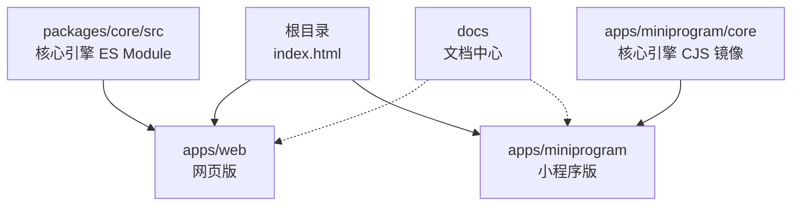
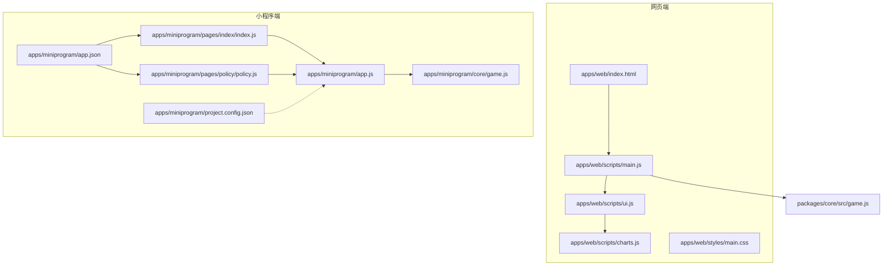
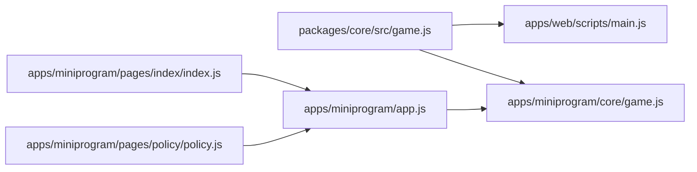

# 快速开始

<cite>
**本文引用的文件**
- [README.md](file://README.md)
- [部署指南.md](file://docs/部署指南.md)
- [游戏说明.md](file://docs/游戏说明.md)
- [index.html](file://index.html)
- [apps/web/index.html](file://apps/web/index.html)
- [apps/web/scripts/main.js](file://apps/web/scripts/main.js)
- [apps/web/scripts/ui.js](file://apps/web/scripts/ui.js)
- [apps/web/scripts/charts.js](file://apps/web/scripts/charts.js)
- [apps/web/styles/main.css](file://apps/web/styles/main.css)
- [packages/core/package.json](file://packages/core/package.json)
- [packages/core/src/game.js](file://packages/core/src/game.js)
- [packages/core/src/config.js](file://packages/core/src/config.js)
- [apps/miniprogram/app.js](file://apps/miniprogram/app.js)
- [apps/miniprogram/app.json](file://apps/miniprogram/app.json)
- [apps/miniprogram/project.config.json](file://apps/miniprogram/project.config.json)
- [apps/miniprogram/core/game.js](file://apps/miniprogram/core/game.js)
- [apps/miniprogram/pages/index/index.js](file://apps/miniprogram/pages/index/index.js)
- [apps/miniprogram/pages/policy/policy.js](file://apps/miniprogram/pages/policy/policy.js)
</cite>

## 目录
1. [简介](#简介)
2. [项目结构](#项目结构)
3. [核心组件](#核心组件)
4. [架构总览](#架构总览)
5. [详细组件分析](#详细组件分析)
6. [依赖关系分析](#依赖关系分析)
7. [性能考虑](#性能考虑)
8. [故障排查](#故障排查)
9. [结论](#结论)
10. [附录](#附录)

## 简介
本指南面向希望快速运行“小国执政官”项目的不同技术背景用户，提供从环境准备、安装步骤到本地浏览器与微信小程序真机预览的完整流程。你将学会：
- 使用 Python 内置 HTTP 服务器在本地启动网页版
- 在浏览器中体验游戏核心玩法
- 在微信开发者工具中导入项目并进行真机预览
- 理解项目根目录与各子目录的职责分工
- 通过存档/读档与事件系统深入体验回合制执政模拟

## 项目结构
项目采用“核心引擎 + 多端应用”的组织方式：
- 根目录包含入口页面与文档
- packages/core 提供平台无关的 ES Module 核心引擎
- apps/web 提供基于浏览器的网页版
- apps/miniprogram 提供微信小程序版，并内置与核心引擎对应的 CommonJS 镜像

图表来源
- [index.html:1-13](file://index.html#L1-L13)
- [apps/web/index.html:1-131](file://apps/web/index.html#L1-L131)
- [packages/core/package.json:1-12](file://packages/core/package.json#L1-L12)
- [apps/miniprogram/core/game.js:1-132](file://apps/miniprogram/core/game.js#L1-132)

章节来源
- [README.md:43-82](file://README.md#L43-L82)
- [index.html:1-13](file://index.html#L1-L13)

## 核心组件
- 核心引擎（packages/core/src）
  - 提供游戏状态机、回合推进、事件抽取、胜负判定与序列化/反序列化
  - 通过导出函数与常量（如 newGame、nextYear、CHAPTERS、CLASS）支撑前端 UI
- 网页端（apps/web）
  - 通过 ES Module 直接引入核心引擎，组合 UI 控制器与可视化图表
  - 提供存档/读档、教程引导与事件弹窗
- 小程序端（apps/miniprogram）
  - 通过 CommonJS require 引入核心引擎镜像，复用相同逻辑
  - 提供页面与全局 App API，封装存档/读档与回合推进

章节来源
- [packages/core/src/game.js:1-185](file://packages/core/src/game.js#L1-L185)
- [apps/web/scripts/main.js:1-77](file://apps/web/scripts/main.js#L1-L77)
- [apps/miniprogram/app.js:1-28](file://apps/miniprogram/app.js#L1-L28)

## 架构总览
下面的架构图展示了“核心引擎”在两端的复用方式以及关键交互。

图表来源
- [apps/web/index.html:1-131](file://apps/web/index.html#L1-L131)
- [apps/web/scripts/main.js:1-77](file://apps/web/scripts/main.js#L1-L77)
- [apps/web/scripts/ui.js:1-139](file://apps/web/scripts/ui.js#L1-L139)
- [apps/web/scripts/charts.js](file://apps/web/scripts/charts.js)
- [apps/web/styles/main.css](file://apps/web/styles/main.css)
- [apps/miniprogram/app.js:1-28](file://apps/miniprogram/app.js#L1-L28)
- [apps/miniprogram/core/game.js:1-132](file://apps/miniprogram/core/game.js#L1-132)
- [apps/miniprogram/pages/index/index.js:1-46](file://apps/miniprogram/pages/index/index.js#L1-L46)
- [apps/miniprogram/pages/policy/policy.js:1-42](file://apps/miniprogram/pages/policy/policy.js#L1-L42)
- [apps/miniprogram/app.json:1-27](file://apps/miniprogram/app.json#L1-L27)
- [apps/miniprogram/project.config.json:1-35](file://apps/miniprogram/project.config.json#L1-L35)
- [packages/core/src/game.js:1-185](file://packages/core/src/game.js#L1-L185)

## 详细组件分析

### 环境要求与安装步骤
- 环境要求
  - 浏览器：现代桌面或移动端浏览器
  - Python：用于本地启动简易 HTTP 服务器（仅网页端）
  - 微信开发者工具：用于导入小程序项目并进行真机预览
- 安装步骤
  1) 克隆仓库并进入目录
  2) 启动本地 HTTP 服务器（网页端）
  3) 在浏览器中访问指定路径
  4) 在微信开发者工具中导入小程序项目目录进行真机预览

章节来源
- [README.md:28-41](file://README.md#L28-L41)
- [部署指南.md:14-48](file://docs/部署指南.md#L14-L48)

### 本地开发环境搭建（Python HTTP 服务器）
- 在项目根目录执行命令启动本地服务
- 在浏览器中访问本地地址进入网页版游戏
- 若需自定义端口，可在命令中修改端口号

章节来源
- [README.md:35-37](file://README.md#L35-L37)

### 浏览器测试
- 启动本地服务后，打开浏览器访问本地地址
- 页面加载后，可通过“ policymain.js 控制器”推进回合、调整政策、查看可视化与事件
- 支持存档/读档与重开，便于反复体验不同策略

章节来源
- [apps/web/scripts/main.js:12-77](file://apps/web/scripts/main.js#L12-L77)
- [apps/web/index.html:1-131](file://apps/web/index.html#L1-L131)

### 微信小程序真机预览
- 在微信开发者工具中选择“导入项目”，目录选择 apps/miniprogram/
- 如需真机预览，使用开发者工具的“真机调试”功能扫码预览
- AppID 配置：打开项目配置文件，将占位 AppID 替换为真实 AppID

章节来源
- [README.md:39-40](file://README.md#L39-L40)
- [apps/miniprogram/project.config.json:1-35](file://apps/miniprogram/project.config.json#L1-L35)

### 项目根目录与子目录职责
- 根目录
  - index.html：重定向到 apps/web/，作为统一入口
- apps/web
  - index.html：页面结构与可视化容器
  - scripts：主控制器、UI 绑定、图表绘制
  - styles：样式文件
- apps/miniprogram
  - app.js / app.json：小程序全局状态与页面配置
  - project.config.json：项目构建与调试设置
  - core：核心引擎的 CommonJS 镜像（与 packages/core 同步）
  - pages：页面逻辑（执政、政策、关于）
- packages/core
  - src：核心引擎源码（ES Module）
  - package.json：模块导出配置

章节来源
- [index.html:1-13](file://index.html#L1-L13)
- [apps/web/index.html:1-131](file://apps/web/index.html#L1-L131)
- [apps/miniprogram/app.json:1-27](file://apps/miniprogram/app.json#L1-L27)
- [packages/core/package.json:1-12](file://packages/core/package.json#L1-L12)

### 游戏核心玩法与操作路径
- 一年三阶段：任命 → 结算 → 决策
- 任命：分配五类公务员配额
- 结算：自动计算生产、税收、工资、军事、教育、消费、满意度、治安、生育与死亡、阶级流动
- 决策：调整三档税率与军费比例，应对随机事件，进入下一年
- 可视化：饼图显示阶级人口，折线图显示历史趋势，日志记录年度事件

章节来源
- [README.md:84-92](file://README.md#L84-L92)
- [游戏说明.md:14-38](file://docs/游戏说明.md#L14-L38)
- [apps/web/scripts/ui.js:46-71](file://apps/web/scripts/ui.js#L46-L71)

### 存档与读档机制
- 网页端：localStorage 存储，支持保存、读取与重开
- 小程序端：使用本地存储接口进行存档与读档

章节来源
- [apps/web/scripts/main.js:49-73](file://apps/web/scripts/main.js#L49-L73)
- [apps/miniprogram/app.js:23-26](file://apps/miniprogram/app.js#L23-L26)

### 事件系统与胜负条件
- 事件：8 张随机事件卡，每次结算后按规则抽取一张，需玩家选择
- 胜负条件：按章节设定目标与时限，满足条件获胜，触发任一失败条件则结束

章节来源
- [游戏说明.md:59-94](file://docs/游戏说明.md#L59-L94)
- [packages/core/src/game.js:133-162](file://packages/core/src/game.js#L133-L162)

## 依赖关系分析
- 网页端通过 ES Module 直接导入核心引擎
- 小程序端通过 CommonJS require 引入核心引擎镜像
- 两端共享相同的配置与常量，保证行为一致

图表来源
- [packages/core/src/game.js:1-185](file://packages/core/src/game.js#L1-L185)
- [apps/web/scripts/main.js:1-77](file://apps/web/scripts/main.js#L1-L77)
- [apps/miniprogram/core/game.js:1-132](file://apps/miniprogram/core/game.js#L1-132)
- [apps/miniprogram/app.js:1-28](file://apps/miniprogram/app.js#L1-L28)
- [apps/miniprogram/pages/index/index.js:1-46](file://apps/miniprogram/pages/index/index.js#L1-L46)
- [apps/miniprogram/pages/policy/policy.js:1-42](file://apps/miniprogram/pages/policy/policy.js#L1-L42)

## 性能考虑
- 核心引擎采用纯原生 JavaScript，避免构建依赖，启动迅速
- 可视化使用 HTML5 Canvas，渲染效率高
- 人口规模较大时启用桶模拟以优化性能（由配置控制）

章节来源
- [README.md:104-108](file://README.md#L104-L108)
- [packages/core/src/config.js:56-58](file://packages/core/src/config.js#L56-L58)

## 故障排查
- GitHub Pages 部署后 404：确认根目录存在特定文件；注意 URL 区分大小写
- 小程序 import 报错：小程序不支持跨包 ES Module 导入，需使用 CommonJS 镜像
- iOS 微信白屏：检查 ES2020 语法兼容性与基础库版本
- GitHub Action 失败：在仓库设置中允许工作流写权限

章节来源
- [部署指南.md:153-162](file://docs/部署指南.md#L153-L162)

## 结论
通过本快速开始指南，你可以：
- 在本地浏览器中直接体验游戏核心玩法
- 在微信开发者工具中完成小程序导入与真机预览
- 理解项目结构与核心引擎在两端的复用方式
- 基于存档/读档与事件系统进行策略实验

## 附录

### 快速命令参考
- 启动本地 HTTP 服务器（网页端）
  - 在项目根目录执行命令启动服务
  - 在浏览器中访问本地地址
- 微信小程序
  - 在开发者工具中“导入项目”，目录选择 apps/miniprogram/
  - 替换项目配置中的 AppID 后进行真机预览

章节来源
- [README.md:35-40](file://README.md#L35-L40)
- [apps/miniprogram/project.config.json:1-35](file://apps/miniprogram/project.config.json#L1-L35)