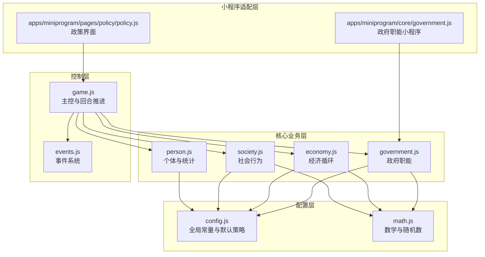
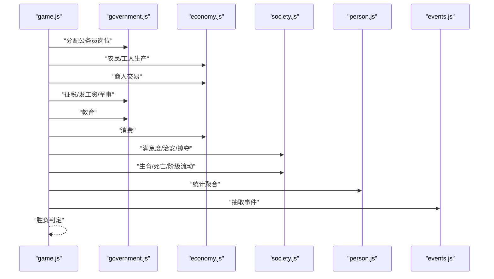
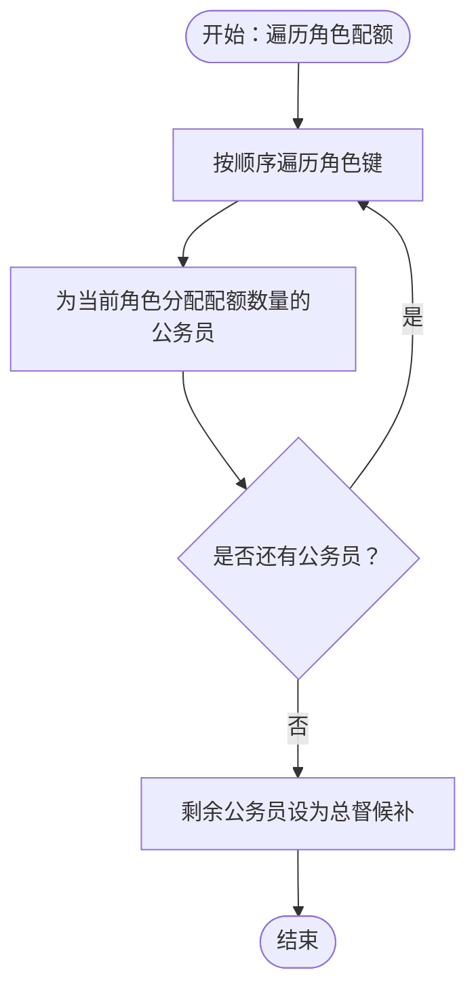
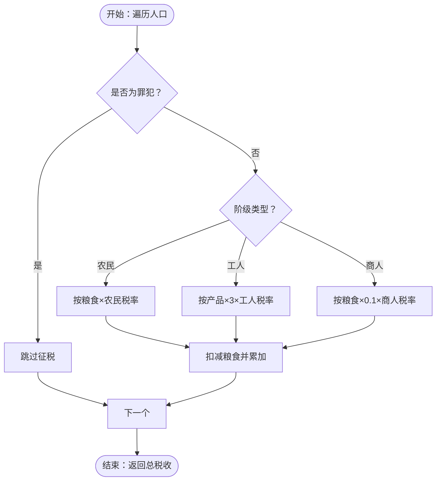
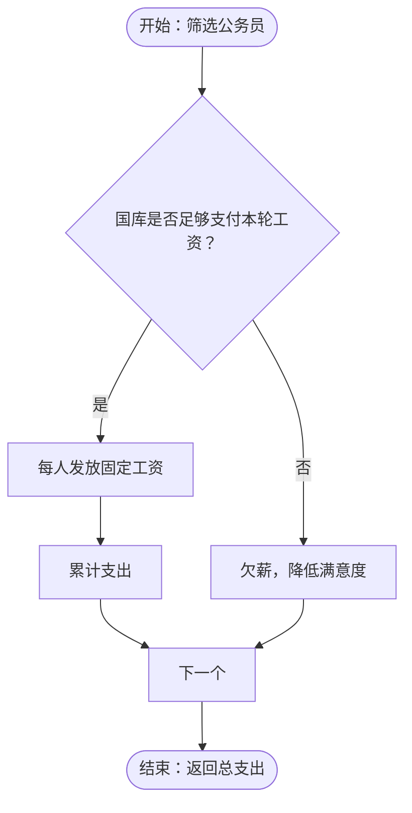
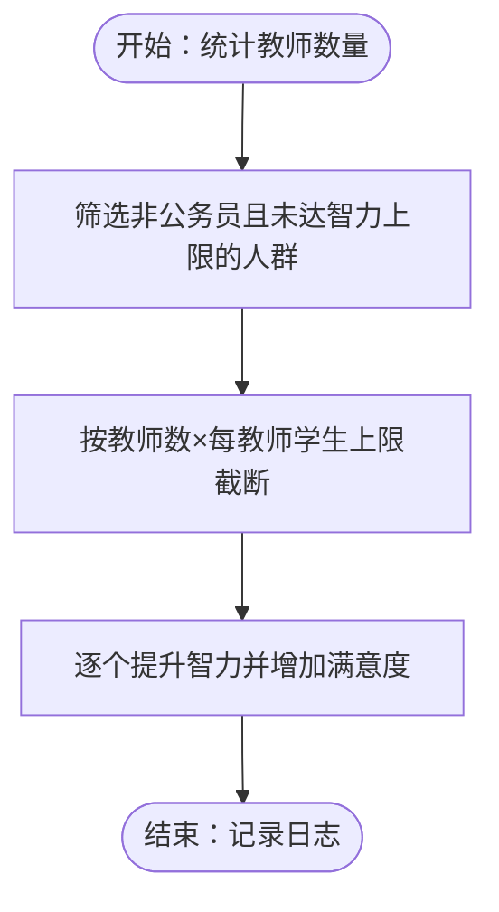
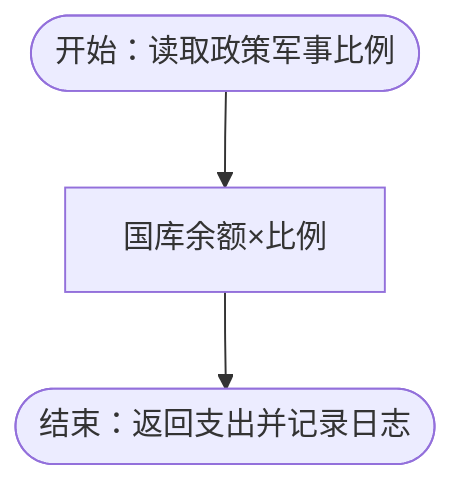
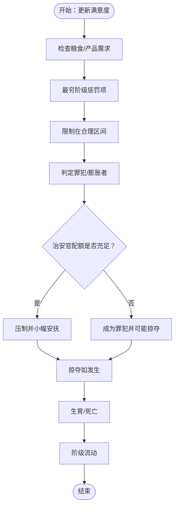
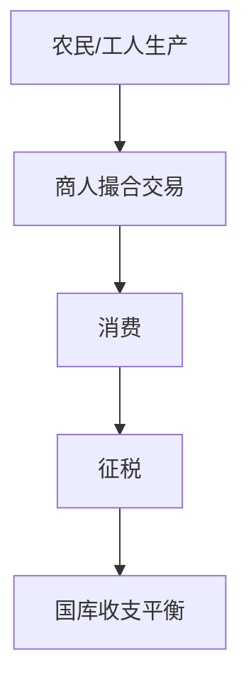
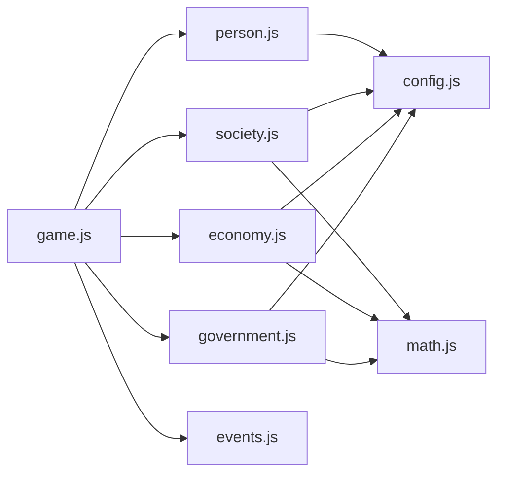

# 政府管理

<cite>
**本文引用的文件**
- [packages/core/src/government.js](file://packages/core/src/government.js)
- [packages/core/src/economy.js](file://packages/core/src/economy.js)
- [packages/core/src/society.js](file://packages/core/src/society.js)
- [packages/core/src/person.js](file://packages/core/src/person.js)
- [packages/core/src/game.js](file://packages/core/src/game.js)
- [packages/core/src/events.js](file://packages/core/src/events.js)
- [packages/core/src/config.js](file://packages/core/src/config.js)
- [packages/core/src/math.js](file://packages/core/src/math.js)
- [apps/miniprogram/core/government.js](file://apps/miniprogram/core/government.js)
- [apps/miniprogram/pages/policy/policy.js](file://apps/miniprogram/pages/policy/policy.js)
</cite>

## 目录
1. [简介](#简介)
2. [项目结构](#项目结构)
3. [核心组件](#核心组件)
4. [架构总览](#架构总览)
5. [详细组件分析](#详细组件分析)
6. [依赖关系分析](#依赖关系分析)
7. [性能考量](#性能考量)
8. [故障排查指南](#故障排查指南)
9. [结论](#结论)
10. [附录](#附录)

## 简介
本文件面向“小国执政官”游戏中的政府管理模块，系统性梳理以下能力：
- 公务员任命系统：五类公务员（教师、工人、商人、士兵、官员）的职责分工与配额分配机制
- 税收政策系统：三档税率设计、税收收入计算与对经济的影响
- 公务员工资管理系统：薪资水平、福利待遇与社会稳定性作用
- 教育投入机制：教育资源分配、人才培养与社会流动影响
- 军事支出控制系统：国防预算、军队规模与国家安全关系

该模块以回合制推进为核心，贯穿生产、交易、消费、征税、发薪、教育、治安、生育死亡、阶级流动等环节，形成完整的治理闭环。

## 项目结构
政府管理模块位于 packages/core/src 下，采用分层设计：
- 核心业务层：government.js（政府职能）、economy.js（经济循环）、society.js（社会行为）、person.js（个体与统计）
- 控制层：game.js（主控与回合推进）、events.js（事件系统）
- 配置层：config.js（全局常量与默认策略）、math.js（数学与随机数）
- 小程序适配层：apps/miniprogram/core/government.js（与 core 对齐的实现）、apps/miniprogram/pages/policy/policy.js（政策界面）

图表来源
- [packages/core/src/government.js:1-82](file://packages/core/src/government.js#L1-L82)
- [packages/core/src/economy.js:1-87](file://packages/core/src/economy.js#L1-L87)
- [packages/core/src/society.js:1-141](file://packages/core/src/society.js#L1-L141)
- [packages/core/src/person.js:1-76](file://packages/core/src/person.js#L1-L76)
- [packages/core/src/game.js:1-185](file://packages/core/src/game.js#L1-L185)
- [packages/core/src/events.js:1-145](file://packages/core/src/events.js#L1-L145)
- [packages/core/src/config.js:1-74](file://packages/core/src/config.js#L1-L74)
- [packages/core/src/math.js:1-49](file://packages/core/src/math.js#L1-L49)
- [apps/miniprogram/core/government.js:1-65](file://apps/miniprogram/core/government.js#L1-L65)
- [apps/miniprogram/pages/policy/policy.js:1-42](file://apps/miniprogram/pages/policy/policy.js#L1-L42)

章节来源
- [packages/core/src/government.js:1-82](file://packages/core/src/government.js#L1-L82)
- [packages/core/src/economy.js:1-87](file://packages/core/src/economy.js#L1-L87)
- [packages/core/src/society.js:1-141](file://packages/core/src/society.js#L1-L141)
- [packages/core/src/person.js:1-76](file://packages/core/src/person.js#L1-L76)
- [packages/core/src/game.js:1-185](file://packages/core/src/game.js#L1-L185)
- [packages/core/src/events.js:1-145](file://packages/core/src/events.js#L1-L145)
- [packages/core/src/config.js:1-74](file://packages/core/src/config.js#L1-L74)
- [packages/core/src/math.js:1-49](file://packages/core/src/math.js#L1-L49)
- [apps/miniprogram/core/government.js:1-65](file://apps/miniprogram/core/government.js#L1-L65)
- [apps/miniprogram/pages/policy/policy.js:1-42](file://apps/miniprogram/pages/policy/policy.js#L1-L42)

## 核心组件
- 政府职能（government.js）：负责公务员岗位分配、征税、发工资、教育、军事、治安官统计
- 经济循环（economy.js）：负责第一产业（农民）、第二产业（工人）、商人交易、消费
- 社会行为（society.js）：负责满意度、罪犯/膨胀者判定、掠夺、生育、死亡、阶级流动
- 个体与统计（person.js）：负责个体属性、种子人口、统计聚合
- 主控与回合（game.js）：负责回合推进、胜负判定、历史快照、事件抽取
- 事件系统（events.js）：提供可玩事件及其条件与选项
- 配置与常量（config.js）：统一参数与默认策略
- 数学与随机数（math.js）：可复现随机数、需求曲线、死亡概率等

章节来源
- [packages/core/src/government.js:1-82](file://packages/core/src/government.js#L1-L82)
- [packages/core/src/economy.js:1-87](file://packages/core/src/economy.js#L1-L87)
- [packages/core/src/society.js:1-141](file://packages/core/src/society.js#L1-L141)
- [packages/core/src/person.js:1-76](file://packages/core/src/person.js#L1-L76)
- [packages/core/src/game.js:1-185](file://packages/core/src/game.js#L1-L185)
- [packages/core/src/events.js:1-145](file://packages/core/src/events.js#L1-L145)
- [packages/core/src/config.js:1-74](file://packages/core/src/config.js#L1-L74)
- [packages/core/src/math.js:1-49](file://packages/core/src/math.js#L1-L49)

## 架构总览
政府管理模块在每回合内按顺序执行以下流程：
1) 分配公务员岗位（按政策配额）
2) 农民生产粮食、工人生产产品
3) 商人撮合交易
4) 征税、发工资、军事支出
5) 教育
6) 消费
7) 更新满意度、治安判定与掠夺
8) 生育与死亡
9) 阶级流动
10) 重新统计、胜负判定、事件抽取

图表来源
- [packages/core/src/game.js:60-117](file://packages/core/src/game.js#L60-L117)
- [packages/core/src/government.js:7-81](file://packages/core/src/government.js#L7-L81)
- [packages/core/src/economy.js:8-86](file://packages/core/src/economy.js#L8-L86)
- [packages/core/src/society.js:9-136](file://packages/core/src/society.js#L9-L136)
- [packages/core/src/person.js:38-75](file://packages/core/src/person.js#L38-L75)
- [packages/core/src/events.js:129-144](file://packages/core/src/events.js#L129-L144)

## 详细组件分析

### 公务员任命系统（五类角色与配额）
- 角色类型：税务官、治安官、福利官、军事官、教师、总督候补
- 配额来源：policy.officials = { tax, security, welfare, military, teacher }
- 分配策略：按目标配额依次分配给公务员群体，剩余人员成为总督候补
- 影响范围：直接影响税收效率、治安控制、教育覆盖、军事预算与社会满意度

图表来源
- [packages/core/src/government.js:7-19](file://packages/core/src/government.js#L7-L19)
- [packages/core/src/config.js:13-20](file://packages/core/src/config.js#L13-L20)

章节来源
- [packages/core/src/government.js:7-19](file://packages/core/src/government.js#L7-L19)
- [packages/core/src/config.js:13-20](file://packages/core/src/config.js#L13-L20)

### 税收政策系统（三档税率与收入计算）
- 税率对象与算法：
  - 农民：按粮食存量乘以农民税率
  - 工人：按产品存量乘以 3 倍再乘以工人税率（产品价值）
  - 商人：按粮食存量乘以 0.1 再乘以商人税率
- 征收规则：排除罪犯；每轮累加至国库；记录日志
- 对经济影响：高税率抑制消费与储蓄，可能降低满意度与生产积极性；低税率促进市场活力但减少财政收入

图表来源
- [packages/core/src/government.js:22-39](file://packages/core/src/government.js#L22-L39)
- [packages/core/src/config.js:39-45](file://packages/core/src/config.js#L39-L45)

章节来源
- [packages/core/src/government.js:22-39](file://packages/core/src/government.js#L22-L39)
- [packages/core/src/config.js:39-45](file://packages/core/src/config.js#L39-L45)

### 公务员工资管理系统（薪资、福利与稳定性）
- 发薪规则：按公务员数量逐个发放固定额度工资，若国库不足则导致欠薪并降低满意度
- 福利影响：欠薪会降低满意度，长期欠薪可能引发不稳定
- 稳定性作用：稳定发薪有助于维持公务员队伍与政府运转效率

图表来源
- [packages/core/src/government.js:42-55](file://packages/core/src/government.js#L42-L55)
- [packages/core/src/config.js:44-45](file://packages/core/src/config.js#L44-L45)

章节来源
- [packages/core/src/government.js:42-55](file://packages/core/src/government.js#L42-L55)
- [packages/core/src/config.js:44-45](file://packages/core/src/config.js#L44-L45)

### 教育投入机制（教师与人才培养）
- 教师角色：非公务员身份，负责提升其他阶级的智力
- 教育覆盖：教师人数 × 每教师学生上限，最多提升至智力上限
- 福利效果：提升受教育者的满意度
- 社会影响：提高整体智力水平，促进阶级流动与社会进步

图表来源
- [packages/core/src/government.js:58-69](file://packages/core/src/government.js#L58-L69)
- [packages/core/src/config.js:47-50](file://packages/core/src/config.js#L47-L50)

章节来源
- [packages/core/src/government.js:58-69](file://packages/core/src/government.js#L58-L69)
- [packages/core/src/config.js:47-50](file://packages/core/src/config.js#L47-L50)

### 军事支出控制系统（预算、规模与安全）
- 支出计算：按国库余额 × 军事预算比例
- 规模控制：通过政策调整军事预算比例，间接控制军队规模
- 安全关系：适度军费保障安全，过度则挤占民生与教育资源

图表来源
- [packages/core/src/government.js:72-76](file://packages/core/src/government.js#L72-L76)
- [packages/core/src/config.js](file://packages/core/src/config.js#L45)

章节来源
- [packages/core/src/government.js:72-76](file://packages/core/src/government.js#L72-L76)
- [packages/core/src/config.js](file://packages/core/src/config.js#L45)

### 社会稳定性与治安控制
- 满意度驱动：粮食与产品不足、财富差距、最穷阶级惩罚等影响满意度
- 罪犯判定：满意度低于阈值触发治安官压制，否则成为罪犯并可能掠夺他人粮食
- 治安官配额：根据治安官数量决定每年可压制的犯罪事件上限
- 社会动态：生育、死亡、阶级流动进一步影响稳定性

图表来源
- [packages/core/src/society.js:9-136](file://packages/core/src/society.js#L9-L136)
- [packages/core/src/government.js:79-81](file://packages/core/src/government.js#L79-L81)

章节来源
- [packages/core/src/society.js:9-136](file://packages/core/src/society.js#L9-L136)
- [packages/core/src/government.js:79-81](file://packages/core/src/government.js#L79-L81)

### 经济循环与税收联动
- 生产：农民产出粮食，工人产出产品并消耗粮食作为生产成本
- 交易：商人从工人批量采购产品，再向农民/公务员销售，形成产品流通
- 消费：所有人消耗粮食与产品，满足基本生存需求
- 税收：在交易与消费之间，通过征税调节国库与社会公平

图表来源
- [packages/core/src/economy.js:8-86](file://packages/core/src/economy.js#L8-L86)
- [packages/core/src/government.js:22-39](file://packages/core/src/government.js#L22-L39)

章节来源
- [packages/core/src/economy.js:8-86](file://packages/core/src/economy.js#L8-L86)
- [packages/core/src/government.js:22-39](file://packages/core/src/government.js#L22-L39)

## 依赖关系分析
- 模块耦合：
  - game.js 作为主控，依赖 government、economy、society、person、events
  - government 依赖 config 与 math
  - economy 依赖 config 与 math
  - society 依赖 config 与 math
  - person 依赖 config
- 关键接口契约：
  - 政策对象包含 tax、militaryRatio、officials
  - 个体属性包含 klass、role、grain、product、satisfaction、isCriminal、isInflated、intelligence、age
- 可能的循环依赖：当前实现未发现循环导入

图表来源
- [packages/core/src/game.js:8-15](file://packages/core/src/game.js#L8-L15)
- [packages/core/src/government.js](file://packages/core/src/government.js#L4)
- [packages/core/src/economy.js](file://packages/core/src/economy.js#L4)
- [packages/core/src/society.js](file://packages/core/src/society.js#L4)
- [packages/core/src/person.js](file://packages/core/src/person.js#L4)
- [packages/core/src/config.js:1-74](file://packages/core/src/config.js#L1-L74)
- [packages/core/src/math.js:1-49](file://packages/core/src/math.js#L1-L49)

章节来源
- [packages/core/src/game.js:8-15](file://packages/core/src/game.js#L8-L15)
- [packages/core/src/government.js](file://packages/core/src/government.js#L4)
- [packages/core/src/economy.js](file://packages/core/src/economy.js#L4)
- [packages/core/src/society.js](file://packages/core/src/society.js#L4)
- [packages/core/src/person.js](file://packages/core/src/person.js#L4)
- [packages/core/src/config.js:1-74](file://packages/core/src/config.js#L1-L74)
- [packages/core/src/math.js:1-49](file://packages/core/src/math.js#L1-L49)

## 性能考量
- 时间复杂度：
  - 政府职能：O(N)，N 为人口规模
  - 经济循环：O(N)，涉及多轮遍历但线性
  - 社会行为：O(N)，满意度、罪犯、生育、死亡均为线性扫描
- 空间复杂度：O(N)，统计与中间数组线性增长
- 优化建议：
  - 人口规模超过阈值时启用桶模式（配置项），减少频繁数组操作
  - 在大规模人口场景下，优先使用聚合统计而非逐条扫描
  - 将高频计算（如需求曲线、死亡概率）缓存或预计算

章节来源
- [packages/core/src/config.js:57-58](file://packages/core/src/config.js#L57-L58)
- [packages/core/src/math.js:32-48](file://packages/core/src/math.js#L32-L48)

## 故障排查指南
- 税收异常：
  - 检查税率配置与政策对象是否正确传入
  - 确认罪犯过滤逻辑生效
- 工资发放失败：
  - 检查国库余额与govWage配置
  - 关注欠薪导致的满意度下降
- 教育无效：
  - 确认教师角色已分配
  - 检查学生上限与智力上限
- 军事支出异常：
  - 检查军事预算比例与国库余额
- 社会不稳定：
  - 关注满意度阈值与财富差距惩罚
  - 治安官配额不足会导致罪犯比例上升

章节来源
- [packages/core/src/government.js:22-76](file://packages/core/src/government.js#L22-L76)
- [packages/core/src/society.js:41-57](file://packages/core/src/society.js#L41-L57)
- [packages/core/src/config.js:28-58](file://packages/core/src/config.js#L28-L58)

## 结论
政府管理模块通过“政策—经济—社会”的闭环设计，实现了对国家运行的精细化控制。公务员任命确保职能覆盖，三档税率平衡财政与市场，公务员工资维系政府稳定，教育投入促进社会进步，军事支出保障国家安全。配合事件系统与章节目标，形成可玩、可测、可调的治理体验。

## 附录
- 政策界面交互：小程序端提供滑动条调整税率、公务员配额与军事比例，实时反映到全局状态
- 默认策略：初始税率与配额在配置中设定，回合推进时可动态修改

章节来源
- [apps/miniprogram/pages/policy/policy.js:1-42](file://apps/miniprogram/pages/policy/policy.js#L1-L42)
- [packages/core/src/config.js:17-21](file://packages/core/src/config.js#L17-L21)