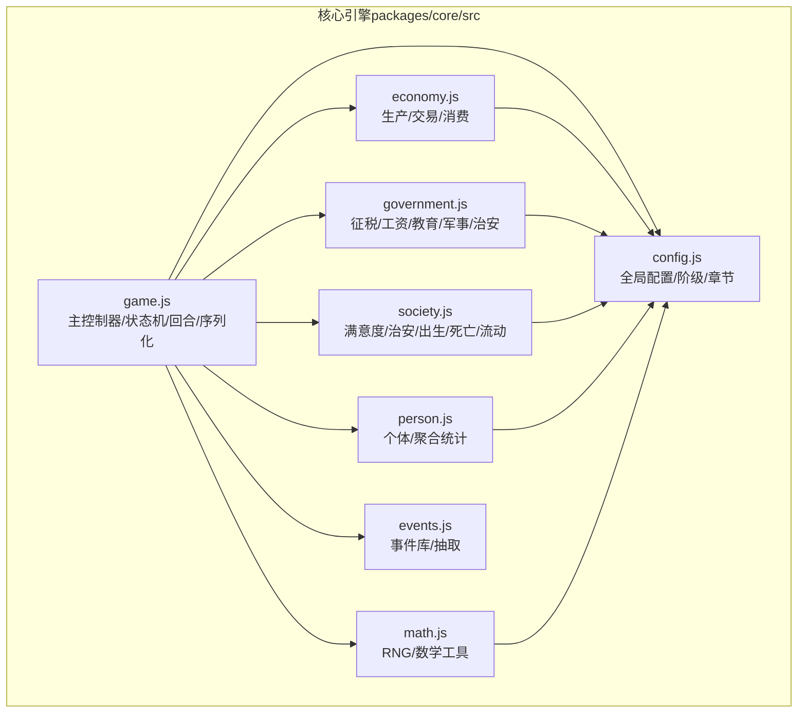
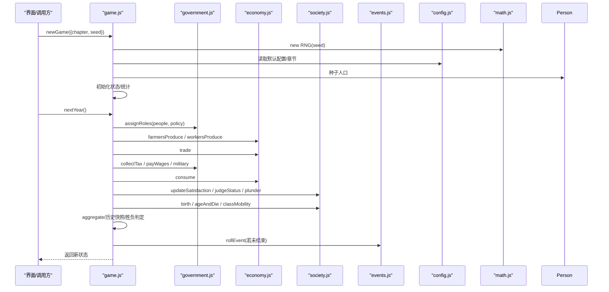
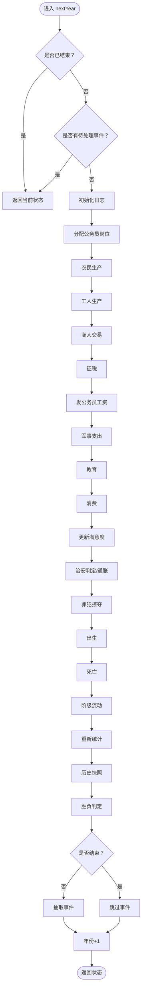
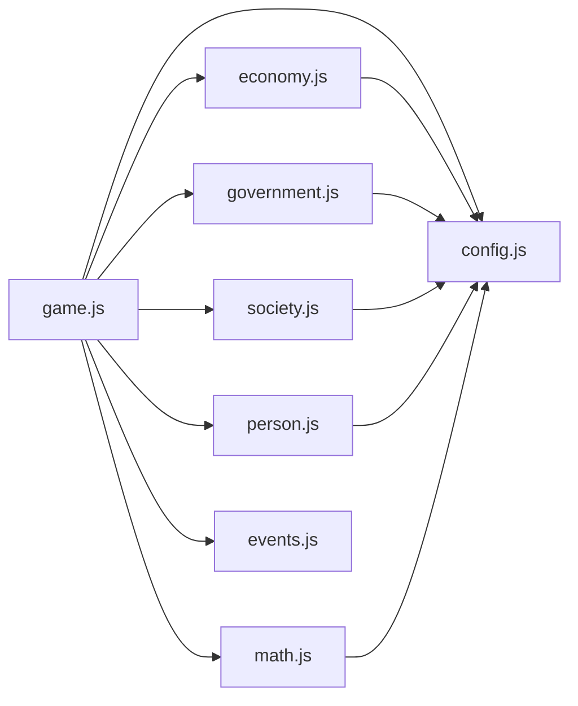

# 核心引擎

<cite>
**本文引用的文件列表**
- [packages/core/src/game.js](file://packages/core/src/game.js)
- [packages/core/src/config.js](file://packages/core/src/config.js)
- [packages/core/src/economy.js](file://packages/core/src/economy.js)
- [packages/core/src/events.js](file://packages/core/src/events.js)
- [packages/core/src/government.js](file://packages/core/src/government.js)
- [packages/core/src/person.js](file://packages/core/src/person.js)
- [packages/core/src/society.js](file://packages/core/src/society.js)
- [packages/core/src/math.js](file://packages/core/src/math.js)
- [packages/core/package.json](file://packages/core/package.json)
- [README.md](file://README.md)
</cite>

## 目录
1. [简介](#简介)
2. [项目结构](#项目结构)
3. [核心组件](#核心组件)
4. [架构总览](#架构总览)
5. [详细组件分析](#详细组件分析)
6. [依赖分析](#依赖分析)
7. [性能考量](#性能考量)
8. [故障排查指南](#故障排查指南)
9. [结论](#结论)
10. [附录：API 参考](#附录api-参考)

## 简介
本文件面向开发者与策划，系统性解析“小国执政官”的核心引擎模块。重点覆盖：
- 游戏主控制器的状态机设计、回合制推进机制与事件调度系统
- 配置管理系统（全局参数、阶级定义、章节规则）
- 核心模块间的依赖关系与数据流转
- API 参考（newGame、nextYear 等）
- 扩展指南与自定义方法建议

该引擎采用纯原生 ES Module，模块职责清晰、边界明确，便于在 Web 与小程序两端复用。

## 项目结构
核心引擎位于 packages/core/src 下，包含以下关键模块：
- config.js：全局配置、阶级枚举、章节规则
- math.js：可复现随机数生成器 RNG 与常用数学工具
- person.js：个体与人口聚合统计
- economy.js：生产、交易、消费
- government.js：政府职能（征税、发薪、教育、军事、治安）
- society.js：满意度、治安、出生死亡、阶级流动
- events.js：事件库与事件抽取
- game.js：主控制器（状态机、回合推进、序列化）

图表来源
- [packages/core/src/game.js:1-185](file://packages/core/src/game.js#L1-L185)
- [packages/core/src/config.js:1-74](file://packages/core/src/config.js#L1-L74)
- [packages/core/src/economy.js:1-87](file://packages/core/src/economy.js#L1-L87)
- [packages/core/src/government.js:1-82](file://packages/core/src/government.js#L1-L82)
- [packages/core/src/person.js:1-76](file://packages/core/src/person.js#L1-L76)
- [packages/core/src/society.js:1-141](file://packages/core/src/society.js#L1-L141)
- [packages/core/src/math.js:1-49](file://packages/core/src/math.js#L1-L49)

章节来源
- [README.md:43-82](file://README.md#L43-L82)

## 核心组件
- 游戏主控制器（game.js）
  - 状态机：year、chapter、chapterName、seed、rng、cfg、policy、treasury、people、log、history、flags、pendingEvent、over、consecutiveBadYears
  - 关键函数：newGame、applyEventOption、nextYear、serialize、deserialize
- 配置系统（config.js）
  - CLASS、OFFICIAL_ROLE、DEFAULT_CONFIG、INITIAL_POPULATION、CHAPTERS
- 经济系统（economy.js）
  - 农民生产、工人生产、商人交易、消费
- 政府系统（government.js）
  - 公务员分配、征税、发薪、教育、军事、治安数量统计
- 社会系统（society.js）
  - 满意度更新、状态判定（罪犯/通胀）、掠夺、出生、死亡、阶级流动
- 人口与统计（person.js）
  - 个体创建、初始人口播种、聚合统计
- 数学与随机（math.js）
  - RNG（xorshift）、正态分布、夹取、产品需求曲线、财富差距惩罚、死亡概率
- 事件系统（events.js）
  - 事件库与加权抽取

章节来源
- [packages/core/src/game.js:1-185](file://packages/core/src/game.js#L1-L185)
- [packages/core/src/config.js:1-74](file://packages/core/src/config.js#L1-L74)
- [packages/core/src/economy.js:1-87](file://packages/core/src/economy.js#L1-L87)
- [packages/core/src/government.js:1-82](file://packages/core/src/government.js#L1-L82)
- [packages/core/src/person.js:1-76](file://packages/core/src/person.js#L1-L76)
- [packages/core/src/society.js:1-141](file://packages/core/src/society.js#L1-L141)
- [packages/core/src/math.js:1-49](file://packages/core/src/math.js#L1-L49)
- [packages/core/src/events.js:1-145](file://packages/core/src/events.js#L1-L145)

## 架构总览
核心引擎采用“主控制器 + 模块化子系统”的分层架构：
- 主控制器负责回合推进、事件调度、胜负判定与存档
- 子系统各自专注领域（经济、政府、社会、人口、数学、事件）
- 配置集中管理，确保数值平衡与可调性
- 数据在模块间以状态对象为载体单向流动

图表来源
- [packages/core/src/game.js:24-117](file://packages/core/src/game.js#L24-L117)
- [packages/core/src/government.js:7-19](file://packages/core/src/government.js#L7-L19)
- [packages/core/src/economy.js:8-86](file://packages/core/src/economy.js#L8-L86)
- [packages/core/src/society.js:9-108](file://packages/core/src/society.js#L9-L108)
- [packages/core/src/events.js:130-144](file://packages/core/src/events.js#L130-L144)
- [packages/core/src/config.js:22-73](file://packages/core/src/config.js#L22-L73)
- [packages/core/src/math.js:5-27](file://packages/core/src/math.js#L5-L27)

## 详细组件分析

### 游戏主控制器（game.js）
- 设计要点
  - 状态机：以 year、chapter、treasury、people、policy、flags、pendingEvent、over 等为核心字段，形成稳定的单向数据流
  - 回合推进：nextYear() 严格遵循“任命→结算→事件”的顺序，保证逻辑一致性
  - 事件调度：rollEvent() 在每回合末抽取事件，applyEventOption() 用于应用事件选项
  - 存档：serialize/deserialize 仅序列化必要字段，RNG 内部状态通过 seed 保持可复现
- 关键流程
  - newGame：初始化 RNG、种子人口、默认政策、初始日志与历史
  - nextYear：依次执行政府、经济、社会子系统，最后进行胜负判定与事件抽取
  - judgeOutcome：综合人口、国库、罪犯比例与章节目标判定胜负
  - snapshot：生成年度统计快照，供 UI 展示

图表来源
- [packages/core/src/game.js:60-117](file://packages/core/src/game.js#L60-L117)
- [packages/core/src/society.js:9-108](file://packages/core/src/society.js#L9-L108)
- [packages/core/src/government.js:22-76](file://packages/core/src/government.js#L22-L76)
- [packages/core/src/economy.js:8-86](file://packages/core/src/economy.js#L8-L86)

章节来源
- [packages/core/src/game.js:24-185](file://packages/core/src/game.js#L24-L185)

### 配置管理系统（config.js）
- 全局参数（DEFAULT_CONFIG）
  - 基础需求：grainNeed、grainReserveNeed、productNeedBase、productReserveNeed
  - 满意度阈值：productDemandLow、productDemandHigh、rebelThreshold、inflatedThreshold
  - 生产：farmerProdMean、farmerProdJitter、workerProdMean、workerProdJitter、productionCost
  - 税率：taxFarmer、taxWorker、taxMerchant（玩家策略变量）
  - 政府：govWage、militaryRatio
  - 教育：teacherPerStudents、intelligenceGainPerYear、intelligenceCap、satisfactionFromEdu
  - 社会动态：birthAgeMin、birthAgeMax、deathStartAge、deathHardCap
  - 性能：bucketModeThreshold（人口阈值，用于桶模拟优化）
- 阶级与角色（CLASS、OFFICIAL_ROLE）
  - 阶级：FARMER、WORKER、MERCHANT、OFFICIAL
  - 官员角色：TAX、SECURITY、WELFARE、MILITARY、TEACHER、GOVERNOR
- 初始人口（INITIAL_POPULATION）
  - 各阶级初始人数，用于 newGame 种子播种
- 章节（CHAPTERS）
  - 包含 id、name、goalYears、minSatisfaction、minTreasury、minPopulation、minIntelligence、allClassMinSat、init 等字段，决定胜负条件与初始设定

章节来源
- [packages/core/src/config.js:6-74](file://packages/core/src/config.js#L6-L74)

### 经济系统（economy.js）
- 农民生产：基于平均值与智力偏差，加入随机扰动，产出粮食
- 工人生产：产出产品，并消耗一定粮食作为生产成本
- 商人交易：批发/零售模式，根据买家满意度与阶级确定 Markup，实现产品流通
- 消费：所有人按基础需求消耗粮食与产品

章节来源
- [packages/core/src/economy.js:8-86](file://packages/core/src/economy.js#L8-L86)

### 政府系统（government.js）
- 公务员分配：按 policy.officials 配额分配角色，剩余为总督候补
- 征税：按阶级与税率计算，农民按粮食、工人按产品估值、商人按粮食
- 发薪：优先支付，不足则降低满意度
- 教育：教师与学生配比，提升智力与满意度
- 军事：按国库比例支出
- 治安统计：统计安全官数量

章节来源
- [packages/core/src/government.js:7-81](file://packages/core/src/government.js#L7-L81)

### 社会系统（society.js）
- 满意度：考虑食物与产品缺口、阶级财富差距惩罚、最穷阶级的额外惩罚
- 治安与通胀：基于满意度阈值判定罪犯/通胀状态
- 掠夺：罪犯随机抢夺邻居粮食
- 出生与死亡：成对配对、满意度影响生育概率；按年龄与死亡上限计算死亡概率
- 阶级流动：智力最高者升级、低资产者降级

章节来源
- [packages/core/src/society.js:9-140](file://packages/core/src/society.js#L9-L140)

### 人口与统计（person.js）
- 个体属性：id、klass、age、intelligence、satisfaction、grain、product、isCriminal、isInflated、role
- 初始播种：按章节 init 配置生成初始人口
- 聚合统计：计算总人口、各阶级人数、平均满意度/智力/财富、罪犯/通胀比例、各阶级财富与满意度均值

章节来源
- [packages/core/src/person.js:9-75](file://packages/core/src/person.js#L9-L75)

### 数学与随机（math.js）
- RNG：32 位 xorshift，提供 uniform、int、normal、pick、chance 等
- clamp：数值夹取
- productDemand：产品需求曲线
- wealthGapPenalty：财富差距惩罚
- deathProb：死亡概率（修复 v1 除零问题）

章节来源
- [packages/core/src/math.js:5-48](file://packages/core/src/math.js#L5-L48)

### 事件系统（events.js）
- 事件库：包含权重、触发条件与选项（标签与应用函数）
- rollEvent：按权重与概率抽取事件，返回 null 表示无事件
- 事件类型：天灾、瘟疫、起义、商队、联姻、通胀等

章节来源
- [packages/core/src/events.js:6-144](file://packages/core/src/events.js#L6-L144)

## 依赖分析
- 模块耦合
  - game.js 是中枢，依赖 config、math、person、economy、government、society、events
  - 子系统内部低耦合，通过状态对象传递数据
- 外部依赖
  - 无外部运行时依赖，仅使用原生 ES Module
- 可能的循环依赖
  - 未发现循环依赖迹象

图表来源
- [packages/core/src/game.js:4-15](file://packages/core/src/game.js#L4-L15)
- [packages/core/src/config.js:1-74](file://packages/core/src/config.js#L1-L74)
- [packages/core/src/economy.js:4-5](file://packages/core/src/economy.js#L4-L5)
- [packages/core/src/government.js:4-4](file://packages/core/src/government.js#L4-L4)
- [packages/core/src/person.js:4-4](file://packages/core/src/person.js#L4-L4)
- [packages/core/src/society.js:4-5](file://packages/core/src/society.js#L4-L5)
- [packages/core/src/math.js:1-3](file://packages/core/src/math.js#L1-L3)

章节来源
- [packages/core/package.json:1-12](file://packages/core/package.json#L1-L12)

## 性能考量
- 人口规模与复杂度
  - DEFAULT_CONFIG.bucketModeThreshold 用于大人口场景的桶模拟优化（在 config.js 中定义）
  - 建议在 UI 层对大规模渲染进行虚拟化或分页展示
- 随机数可复现
  - RNG 使用固定种子，确保回放一致，适合调试与数值平衡验证
- 时间复杂度
  - 主要瓶颈在遍历人群（O(N)）与排序（O(K log K)，K 为候选升级/降级个体）
  - 交易环节存在多轮筛选与随机选择，建议在大数据量时引入更高效的匹配算法

[本节为通用性能讨论，不直接分析具体代码文件]

## 故障排查指南
- 回合推进异常
  - 若出现 pendingEvent 未处理即推进回合，需先调用 applyEventOption 再 nextYear
- 胜负判定错误
  - 检查章节目标与当前状态统计（人口、国库、平均满意度、阶级比例）
- 事件不出现
  - 确认 rollEvent 条件与权重；检查概率阈值与随机种子
- 存档/读档失败
  - 确保序列化字段完整，RNG 状态通过 seed 保持一致

章节来源
- [packages/core/src/game.js:50-57](file://packages/core/src/game.js#L50-L57)
- [packages/core/src/game.js:134-162](file://packages/core/src/game.js#L134-L162)
- [packages/core/src/events.js:130-144](file://packages/core/src/events.js#L130-L144)

## 结论
核心引擎以清晰的模块划分与严格的回合流程实现了完整的回合制经济社会模拟。通过集中配置与可复现随机数，既满足了策划数值平衡的需求，也为扩展与移植提供了良好基础。建议在后续迭代中：
- 引入更精细的事件与 UI 交互
- 优化大规模人口下的性能表现
- 增强存档兼容性与版本迁移能力

[本节为总结性内容，不直接分析具体代码文件]

## 附录：API 参考

### newGame(options)
- 功能：创建新游戏状态
- 参数
  - chapter：章节编号，默认为 1
  - seed：随机种子，默认为当前时间戳
- 返回：初始状态对象（包含 year、chapter、chapterName、seed、rng、cfg、policy、treasury、people、log、history、flags、pendingEvent、over、consecutiveBadYears、stats）

章节来源
- [packages/core/src/game.js:24-47](file://packages/core/src/game.js#L24-L47)

### nextYear(state)
- 功能：推进一年，执行完整的回合结算与事件抽取
- 参数：state（游戏状态）
- 返回：更新后的状态对象
- 注意：若存在 pendingEvent 或游戏已结束，将直接返回

章节来源
- [packages/core/src/game.js:60-117](file://packages/core/src/game.js#L60-L117)

### applyEventOption(state, optionIndex)
- 功能：应用当前事件的选项
- 参数
  - state：游戏状态
  - optionIndex：选项索引（从 0 开始）
- 返回：更新后的状态对象

章节来源
- [packages/core/src/game.js:50-57](file://packages/core/src/game.js#L50-L57)

### serialize(state)
- 功能：序列化存档（仅保存必要字段，RNG 内部状态通过 seed 保持可复现）
- 参数：state（游戏状态）
- 返回：JSON 字符串

章节来源
- [packages/core/src/game.js:165-172](file://packages/core/src/game.js#L165-L172)

### deserialize(json)
- 功能：反序列化存档
- 参数：json（序列化字符串）
- 返回：恢复的游戏状态对象

章节来源
- [packages/core/src/game.js:174-182](file://packages/core/src/game.js#L174-L182)

### rollEvent(state)
- 功能：按权重与概率抽取本年度事件
- 参数：state（游戏状态）
- 返回：事件对象或 null

章节来源
- [packages/core/src/events.js:130-144](file://packages/core/src/events.js#L130-L144)

### 其他核心函数（来自子模块）
- 经济：farmersProduce、workersProduce、trade、consume
- 政府：assignRoles、collectTax、payWages、educate、military、securityCount
- 社会：updateSatisfaction、judgeStatus、plunder、birth、ageAndDie、classMobility
- 人口：seedPopulation、aggregate
- 数学：RNG、clamp、productDemand、wealthGapPenalty、deathProb

章节来源
- [packages/core/src/economy.js:8-86](file://packages/core/src/economy.js#L8-L86)
- [packages/core/src/government.js:7-81](file://packages/core/src/government.js#L7-L81)
- [packages/core/src/society.js:9-140](file://packages/core/src/society.js#L9-L140)
- [packages/core/src/person.js:29-75](file://packages/core/src/person.js#L29-L75)
- [packages/core/src/math.js:5-48](file://packages/core/src/math.js#L5-L48)