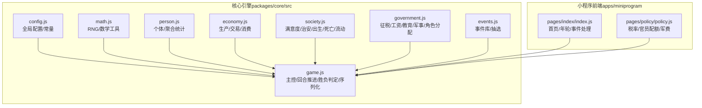
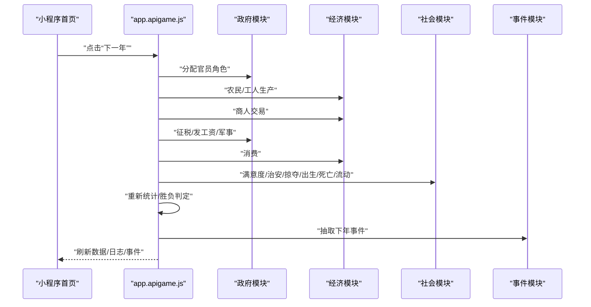
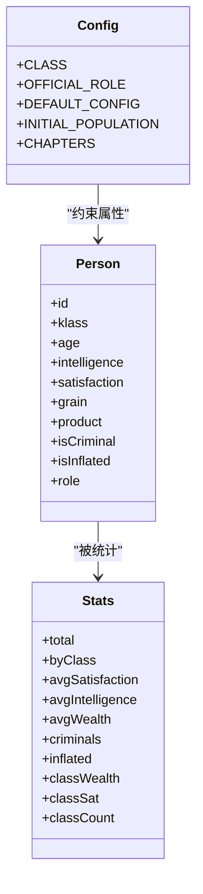
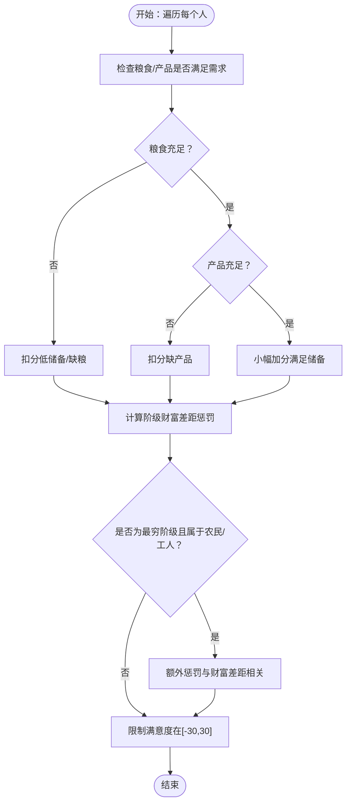
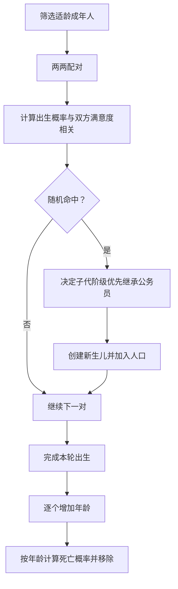
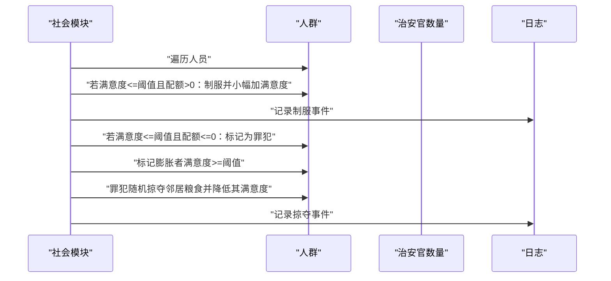
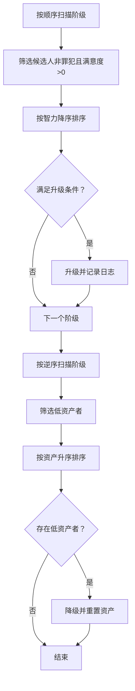
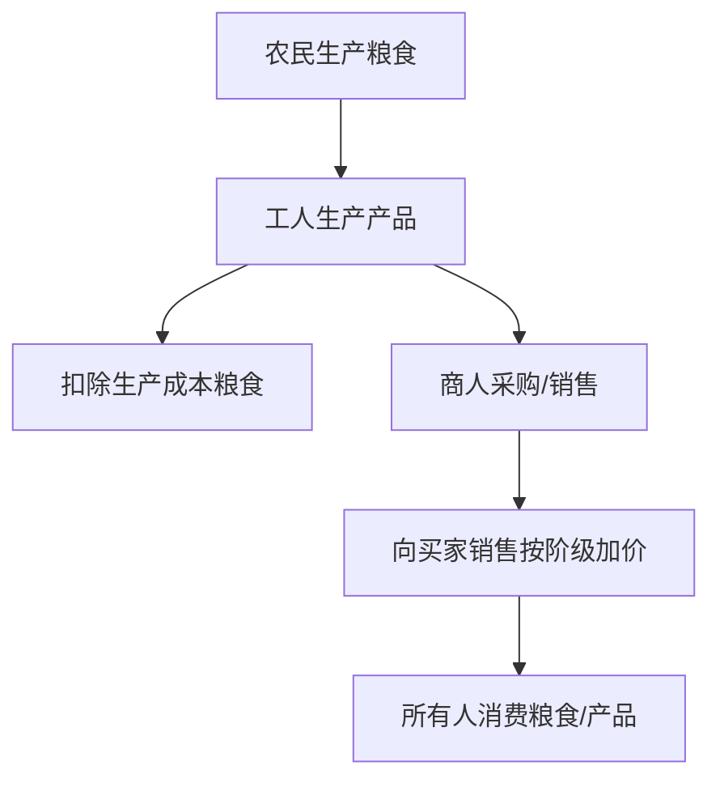
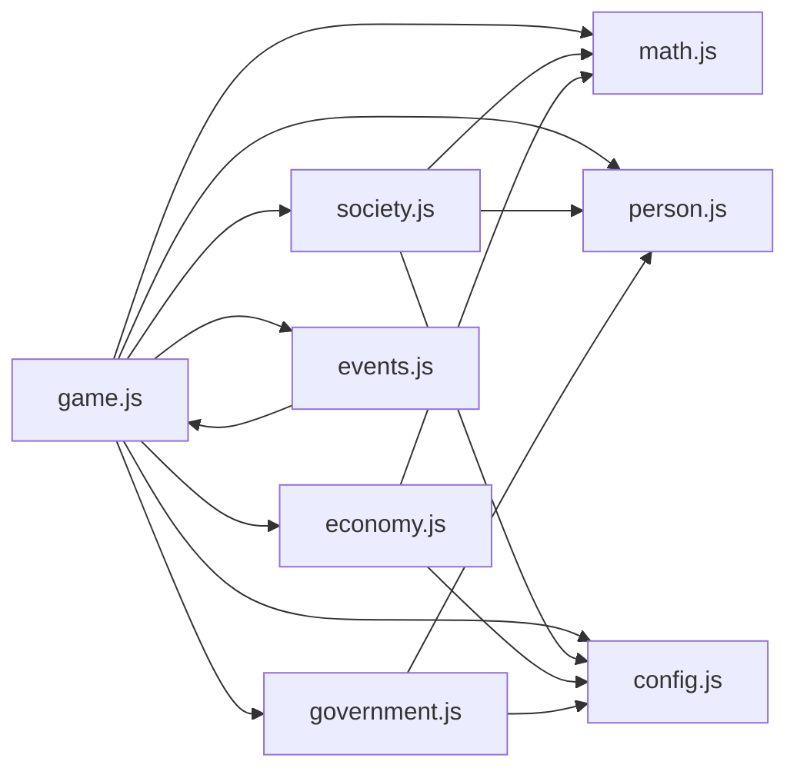

# 社会系统

<cite>
**本文引用的文件**
- [packages/core/src/society.js](file://packages/core/src/society.js)
- [packages/core/src/person.js](file://packages/core/src/person.js)
- [packages/core/src/economy.js](file://packages/core/src/economy.js)
- [packages/core/src/government.js](file://packages/core/src/government.js)
- [packages/core/src/events.js](file://packages/core/src/events.js)
- [packages/core/src/config.js](file://packages/core/src/config.js)
- [packages/core/src/math.js](file://packages/core/src/math.js)
- [packages/core/src/game.js](file://packages/core/src/game.js)
- [apps/miniprogram/pages/index/index.js](file://apps/miniprogram/pages/index/index.js)
- [apps/miniprogram/pages/policy/policy.js](file://apps/miniprogram/pages/policy/policy.js)
</cite>

## 目录
1. [简介](#简介)
2. [项目结构](#项目结构)
3. [核心组件](#核心组件)
4. [架构总览](#架构总览)
5. [详细组件分析](#详细组件分析)
6. [依赖分析](#依赖分析)
7. [性能考虑](#性能考虑)
8. [故障排查指南](#故障排查指南)
9. [结论](#结论)
10. [附录](#附录)

## 简介
本技术文档聚焦“小国执政官”社会模拟系统的底层实现，围绕以下主题进行深入解析：
- 阶级结构模型：六阶级定义、流动性机制与相互关系
- 满意度计算系统：生活成本、收入水平、公共服务对民众满意度的影响
- 出生率与死亡率模型：人口自然增长与减少的计算逻辑
- 治安管理：犯罪率、社会秩序维护机制
- 社会动荡与起义：负面事件的触发条件与影响范围

该系统采用回合制推进，每年经历“任命 → 结算 → 决策”的循环，通过可调参数与随机性共同驱动社会动态演化。

## 项目结构
核心逻辑位于 packages/core/src 下，包含社会、经济、政府、事件、数学工具与全局配置等模块；小程序前端通过 app.api 调用核心状态机，完成交互与展示。

图表来源
- [packages/core/src/game.js:1-185](file://packages/core/src/game.js#L1-L185)
- [packages/core/src/config.js:1-74](file://packages/core/src/config.js#L1-L74)
- [packages/core/src/math.js:1-49](file://packages/core/src/math.js#L1-L49)
- [packages/core/src/person.js:1-76](file://packages/core/src/person.js#L1-L76)
- [packages/core/src/economy.js:1-87](file://packages/core/src/economy.js#L1-L87)
- [packages/core/src/society.js:1-141](file://packages/core/src/society.js#L1-L141)
- [packages/core/src/government.js:1-82](file://packages/core/src/government.js#L1-L82)
- [packages/core/src/events.js:1-145](file://packages/core/src/events.js#L1-L145)
- [apps/miniprogram/pages/index/index.js:1-46](file://apps/miniprogram/pages/index/index.js#L1-L46)
- [apps/miniprogram/pages/policy/policy.js:1-42](file://apps/miniprogram/pages/policy/policy.js#L1-L42)

章节来源
- [packages/core/src/config.js:1-74](file://packages/core/src/config.js#L1-L74)
- [packages/core/src/game.js:1-185](file://packages/core/src/game.js#L1-L185)

## 核心组件
- 配置与常量：统一管理阶级枚举、官员角色、默认配置、章节目标与初始人口
- 数学工具：提供可复现的随机数生成器、产品需求函数、财富差距惩罚、死亡概率
- 个体与聚合：定义个人属性、创建初始人口、统计阶级财富/满意度/人数等指标
- 经济模块：第一产业（农民）、第二产业（工人）、商人交易、消费
- 社会模块：满意度更新、治安判定与抑制、掠夺、出生、死亡、阶级流动
- 政府模块：官员角色分配、征税、发工资、教育、军事、治安官数量
- 事件模块：8张事件卡及其触发条件与选项效果
- 主控模块：回合推进、胜负判定、历史快照、序列化/反序列化

章节来源
- [packages/core/src/config.js:1-74](file://packages/core/src/config.js#L1-L74)
- [packages/core/src/math.js:1-49](file://packages/core/src/math.js#L1-L49)
- [packages/core/src/person.js:1-76](file://packages/core/src/person.js#L1-L76)
- [packages/core/src/economy.js:1-87](file://packages/core/src/economy.js#L1-L87)
- [packages/core/src/society.js:1-141](file://packages/core/src/society.js#L1-L141)
- [packages/core/src/government.js:1-82](file://packages/core/src/government.js#L1-L82)
- [packages/core/src/events.js:1-145](file://packages/core/src/events.js#L1-L145)
- [packages/core/src/game.js:1-185](file://packages/core/src/game.js#L1-L185)

## 架构总览
系统采用“模块化分层 + 可调参数”的设计，主控模块按固定顺序调用各子模块，形成完整的年度结算闭环。前端通过页面脚本与主控交互，实现策略输入与结果展示。

图表来源
- [packages/core/src/game.js:60-117](file://packages/core/src/game.js#L60-L117)
- [packages/core/src/government.js:6-82](file://packages/core/src/government.js#L6-L82)
- [packages/core/src/economy.js:7-87](file://packages/core/src/economy.js#L7-L87)
- [packages/core/src/society.js:8-141](file://packages/core/src/society.js#L8-L141)
- [packages/core/src/events.js:129-145](file://packages/core/src/events.js#L129-L145)
- [apps/miniprogram/pages/index/index.js:22-45](file://apps/miniprogram/pages/index/index.js#L22-L45)

## 详细组件分析

### 阶级结构模型
- 阶级定义：农民、工人、商人、公务员（OFFICIAL）
- 角色分配：根据政策将公务员分配到税务、治安、福利、军事、教师等岗位
- 初始人口：按章节配置初始化，确保不同阶段的人口规模与结构差异
- 聚合统计：按阶级统计财富、满意度、人数，并计算平均值

图表来源
- [packages/core/src/person.js:9-76](file://packages/core/src/person.js#L9-L76)
- [packages/core/src/config.js:6-74](file://packages/core/src/config.js#L6-L74)

章节来源
- [packages/core/src/person.js:37-76](file://packages/core/src/person.js#L37-L76)
- [packages/core/src/config.js:60-74](file://packages/core/src/config.js#L60-L74)

### 满意度计算系统
满意度受以下因素影响：
- 粮食与产品需求：当低于基本需求时大幅扣分，接近储备需求时轻微扣分，高于储备需求时小幅加分
- 阶级财富差距：基于各阶级平均财富差计算惩罚项，最穷阶级在特定条件下额外受罚
- 最穷阶级识别：统计各阶级平均财富，确定最穷阶级并对该阶级成员施加额外惩罚

图表来源
- [packages/core/src/society.js:8-38](file://packages/core/src/society.js#L8-L38)
- [packages/core/src/math.js:36-41](file://packages/core/src/math.js#L36-L41)

章节来源
- [packages/core/src/society.js:8-38](file://packages/core/src/society.js#L8-L38)
- [packages/core/src/math.js:36-41](file://packages/core/src/math.js#L36-L41)

### 出生率与死亡率模型
- 出生：成年人两两配对，满意度越高出生概率越大；若双方之一为公务员，则子代继承其阶级；新生儿初始拥有少量粮食与产品
- 死亡：按年龄计算死亡概率，随年龄增长而上升，达到上限后恒定为1；使用可复现随机数保证可重现性

图表来源
- [packages/core/src/society.js:76-108](file://packages/core/src/society.js#L76-L108)
- [packages/core/src/math.js:43-48](file://packages/core/src/math.js#L43-L48)

章节来源
- [packages/core/src/society.js:76-108](file://packages/core/src/society.js#L76-L108)
- [packages/core/src/math.js:43-48](file://packages/core/src/math.js#L43-L48)

### 治安管理与社会秩序
- 罪犯判定：当满意度低于阈值时可能成为罪犯；治安官数量决定每年可制服的事件配额
- 制服与安抚：制服后小幅提升满意度；未被制服则变为罪犯并可能进行掠夺
- 掠夺机制：罪犯随机抢夺邻居的粮食，降低对方满意度
- 膨胀者判定：当满意度高于阈值时标记为膨胀者

图表来源
- [packages/core/src/society.js:40-74](file://packages/core/src/society.js#L40-L74)
- [packages/core/src/government.js:78-82](file://packages/core/src/government.js#L78-L82)

章节来源
- [packages/core/src/society.js:40-74](file://packages/core/src/society.js#L40-L74)
- [packages/core/src/government.js:78-82](file://packages/core/src/government.js#L78-L82)

### 阶级流动机制
- 升级：按阶级顺序（农民→工人→商人）筛选候选人，要求非罪犯且满意度>0，按智力排序，连续3年达标者升级
- 降级：按阶级逆序（商人→工人→农民）筛选低资产者，按资产排序，连续低资产者降级并重置资产

图表来源
- [packages/core/src/society.js:110-136](file://packages/core/src/society.js#L110-L136)

章节来源
- [packages/core/src/society.js:110-136](file://packages/core/src/society.js#L110-L136)

### 经济与消费循环
- 农业生产：农民按智力与均值/抖动产生粮食，受随机扰动影响
- 工业生产：工人按智力与均值/抖动产生产品，同时消耗粮食作为生产成本
- 商业交易：商人从工人批量采购产品，再向农民/公务员销售，按阶级设定不同加价
- 消费：所有人按固定需求消耗粮食与产品

图表来源
- [packages/core/src/economy.js:7-87](file://packages/core/src/economy.js#L7-L87)

章节来源
- [packages/core/src/economy.js:7-87](file://packages/core/src/economy.js#L7-L87)

### 政府职能与财政
- 征税：按阶级设定税率，农民按粮食、工人按产品价值、商人按粮食计税
- 工资：按预算发放公务员工资，不足时导致满意度下降
- 教育：教师提升非公务员智力，同时提高满意度
- 军事：按国库比例支出
- 治安官：统计数量用于治安抑制

章节来源
- [packages/core/src/government.js:21-82](file://packages/core/src/government.js#L21-L82)

### 事件系统与负面事件
事件库包含8种事件，每种事件具有权重、触发条件与选项，选项会修改国家状态（如国库、人口、满意度等）。负面事件包括：
- 瘟疫：随机死亡或封城治疗
- 蝗灾：开仓赈灾或听天由命
- 通胀：商人/农工满意度受影响
- 密报：增派治安官或安抚流民

章节来源
- [packages/core/src/events.js:6-145](file://packages/core/src/events.js#L6-L145)

## 依赖分析
- 模块耦合：主控模块集中协调各子模块，耦合度适中；子模块内部职责清晰
- 外部依赖：仅依赖标准 ES Module 与本地模块，无第三方库
- 数据流向：主控模块持有全局状态，子模块通过函数参数读取/写入状态

图表来源
- [packages/core/src/game.js:1-185](file://packages/core/src/game.js#L1-L185)
- [packages/core/src/society.js:1-141](file://packages/core/src/society.js#L1-L141)
- [packages/core/src/economy.js:1-87](file://packages/core/src/economy.js#L1-L87)
- [packages/core/src/government.js:1-82](file://packages/core/src/government.js#L1-L82)
- [packages/core/src/events.js:1-145](file://packages/core/src/events.js#L1-L145)
- [packages/core/src/person.js:1-76](file://packages/core/src/person.js#L1-L76)
- [packages/core/src/math.js:1-49](file://packages/core/src/math.js#L1-L49)
- [packages/core/src/config.js:1-74](file://packages/core/src/config.js#L1-L74)

章节来源
- [packages/core/src/game.js:1-185](file://packages/core/src/game.js#L1-L185)

## 性能考虑
- 时间复杂度：多数操作为 O(n)，其中 n 为人口规模；在人口较大时可通过配置启用桶模拟模式（阈值见配置）
- 内存占用：状态对象包含历史快照与日志，建议在长线存档时关注内存使用
- 随机性：使用可复现的随机数生成器，便于调试与回放

章节来源
- [packages/core/src/config.js:56-58](file://packages/core/src/config.js#L56-L58)
- [packages/core/src/math.js:5-27](file://packages/core/src/math.js#L5-L27)

## 故障排查指南
- 无法推进年份：若存在待决策事件，需先选择事件选项再推进
- 事件未出现：事件抽选存在概率门槛，且按权重加权抽取
- 人口归零：检查死亡概率与出生概率是否失衡，适当调整政策
- 国库长期为负：检查税率与军事比例，优化征税与支出结构
- 治安恶化：增加治安官配额或提升公务员工资以改善满意度

章节来源
- [apps/miniprogram/pages/index/index.js:22-45](file://apps/miniprogram/pages/index/index.js#L22-L45)
- [packages/core/src/game.js:133-162](file://packages/core/src/game.js#L133-L162)
- [packages/core/src/events.js:129-145](file://packages/core/src/events.js#L129-L145)

## 结论
本社会模拟系统通过明确的模块划分与可调参数，实现了从经济生产到社会治安、从阶级流动到随机事件的完整闭环。满意度作为核心变量贯穿多个模块，既反映政策效果也驱动后续动态。建议在实际运营中：
- 保持税率与支出的平衡，避免长期财政赤字
- 关注阶级间财富差距与最穷阶级状况，防止社会撕裂
- 合理配置治安官与教育投入，维持社会秩序与长期发展
- 利用事件系统引入多样化挑战，增强策略深度与可玩性

## 附录
- 前端交互：小程序首页负责年轮推进与事件处理，政策页负责调整税率、官员配额与军费比例
- 存档与回放：主控模块提供序列化/反序列化接口，保留种子以确保可复现

章节来源
- [apps/miniprogram/pages/index/index.js:1-46](file://apps/miniprogram/pages/index/index.js#L1-L46)
- [apps/miniprogram/pages/policy/policy.js:1-42](file://apps/miniprogram/pages/policy/policy.js#L1-L42)
- [packages/core/src/game.js:164-182](file://packages/core/src/game.js#L164-L182)