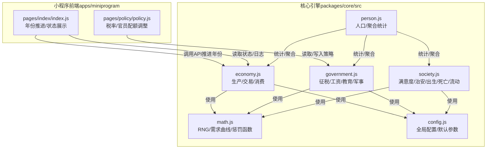
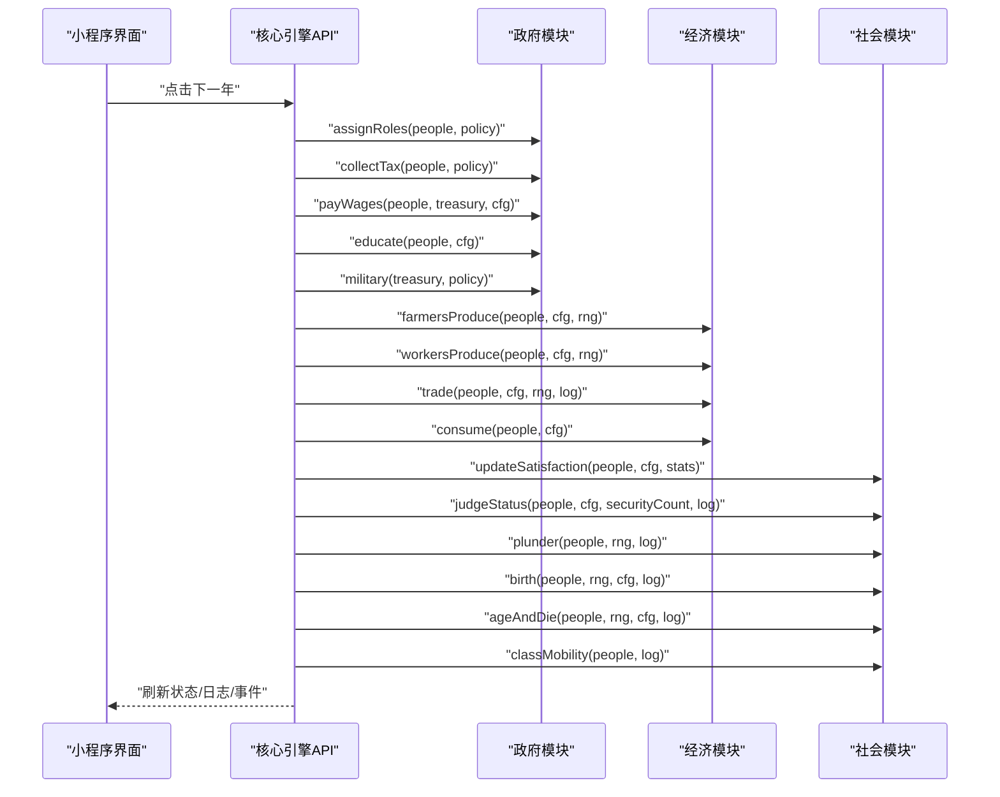
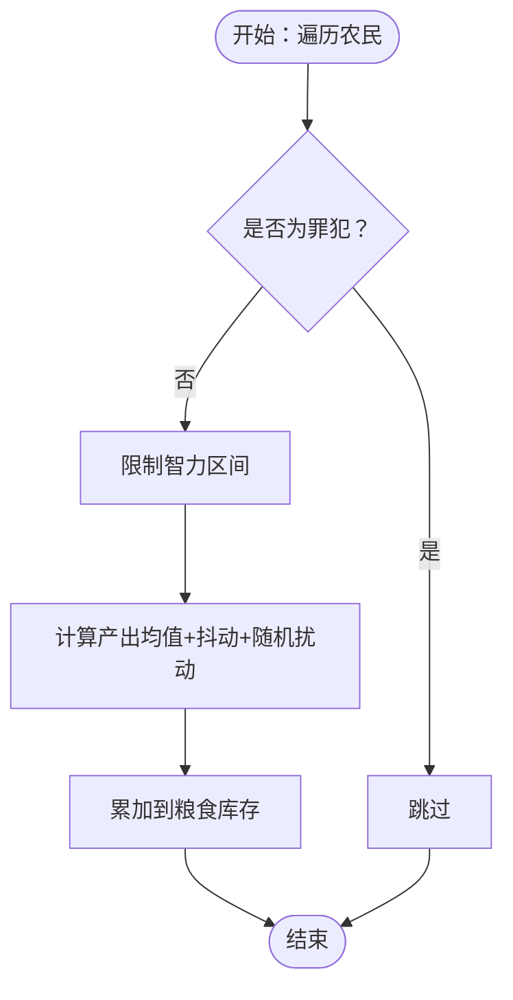
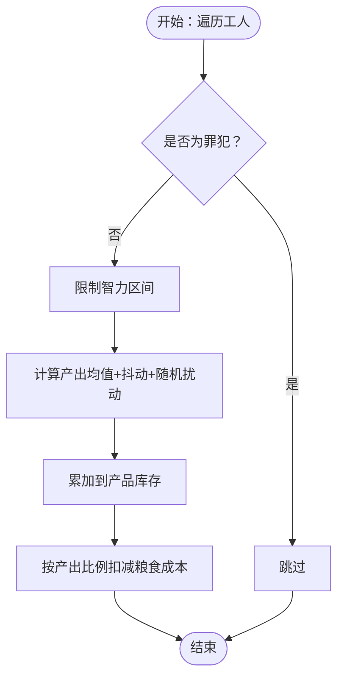
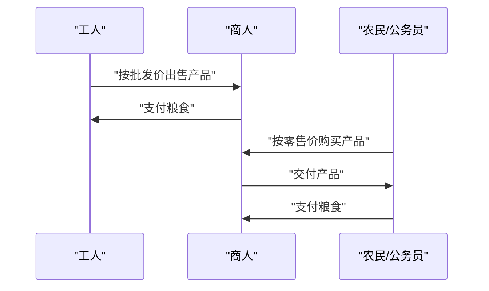
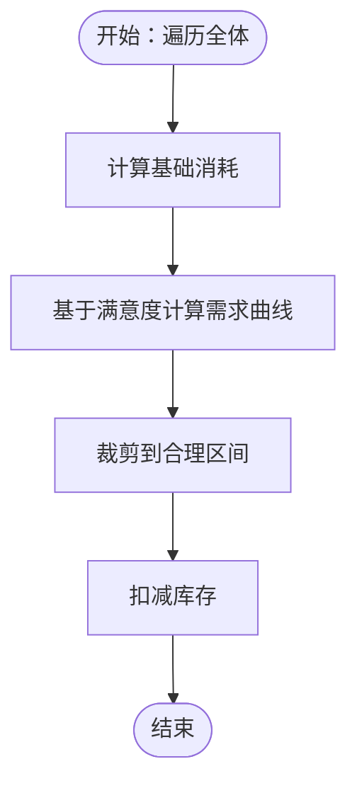
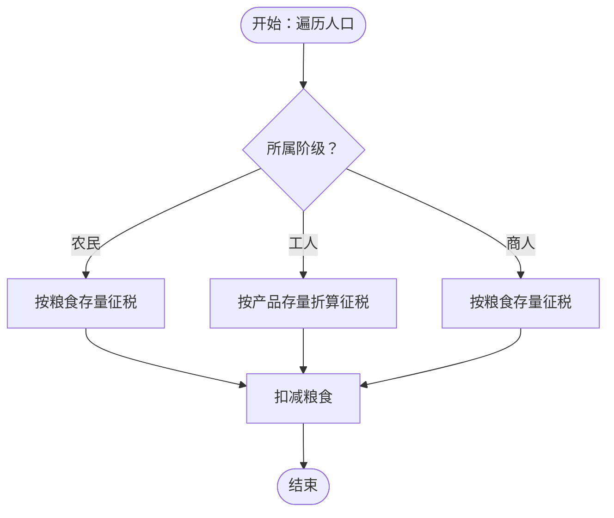
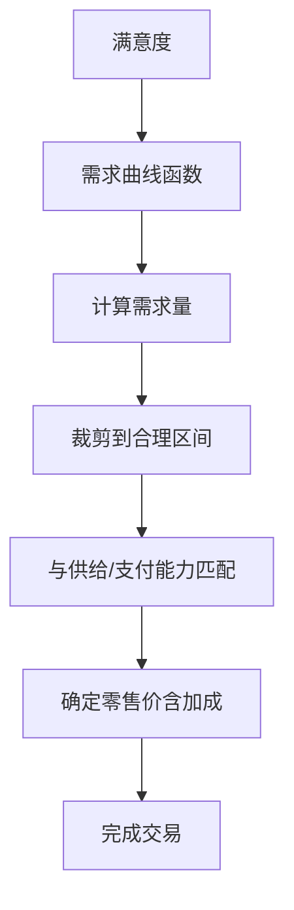
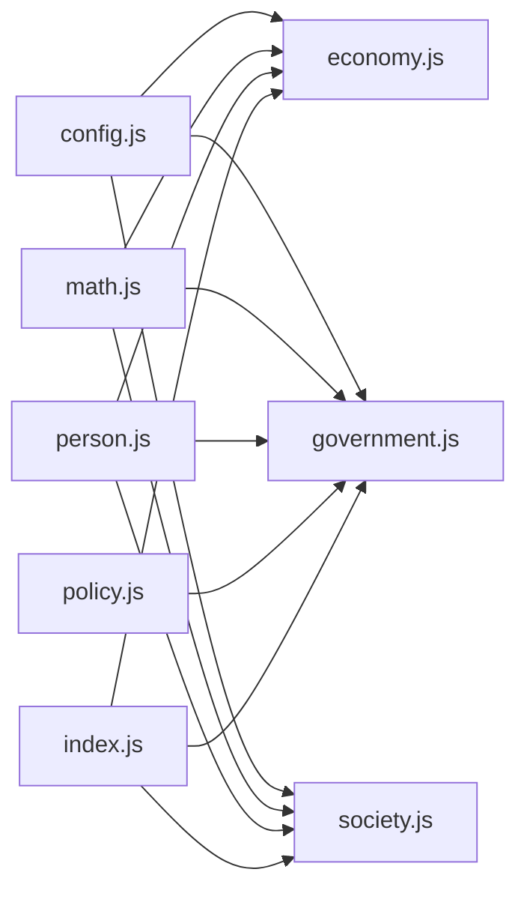

# 经济系统

<cite>
**本文引用的文件**
- [packages/core/src/economy.js](file://packages/core/src/economy.js)
- [apps/miniprogram/core/economy.js](file://apps/miniprogram/core/economy.js)
- [packages/core/src/government.js](file://packages/core/src/government.js)
- [apps/miniproogram/core/government.js](file://apps/miniprogram/core/government.js)
- [packages/core/src/society.js](file://packages/core/src/society.js)
- [apps/miniprogram/core/society.js](file://apps/miniprogram/core/society.js)
- [packages/core/src/math.js](file://packages/core/src/math.js)
- [apps/miniprogram/core/math.js](file://apps/miniprogram/core/math.js)
- [packages/core/src/config.js](file://packages/core/src/config.js)
- [apps/miniprogram/core/config.js](file://apps/miniprogram/core/config.js)
- [packages/core/src/person.js](file://packages/core/src/person.js)
- [apps/miniprogram/core/person.js](file://apps/miniprogram/core/person.js)
- [apps/miniprogram/pages/policy/policy.js](file://apps/miniprogram/pages/policy/policy.js)
- [apps/miniprogram/pages/index/index.js](file://apps/miniprogram/pages/index/index.js)
- [README.md](file://README.md)
</cite>

## 目录
1. [引言](#引言)
2. [项目结构](#项目结构)
3. [核心组件](#核心组件)
4. [架构总览](#架构总览)
5. [详细组件分析](#详细组件分析)
6. [依赖分析](#依赖分析)
7. [性能考虑](#性能考虑)
8. [故障排查指南](#故障排查指南)
9. [结论](#结论)
10. [附录](#附录)

## 引言
本文件面向“小国执政官”的经济系统，系统性梳理农业生产、工业生产、商业贸易与消费需求的机制与数据流，解释粮食产量、工业产值、商业利润等关键指标的计算路径与影响因素，并阐述税收政策对经济活动的激励与抑制作用。同时结合价格弹性与供需关系，给出经济平衡与数值调优建议，帮助策划与开发者实现稳定、可预期且具策略深度的回合制经济社会模拟。

## 项目结构
经济系统由核心引擎与前端界面两部分组成：
- 核心引擎（packages/core/src）：包含经济、政府、社会、数学工具、配置与人口模型等模块，负责回合推进与数值结算。
- 小程序前端（apps/miniprogram）：提供政策调整界面与状态展示，连接核心引擎 API，驱动年份推进与事件处理。

图表来源
- [packages/core/src/economy.js:1-87](file://packages/core/src/economy.js#L1-L87)
- [packages/core/src/government.js:1-82](file://packages/core/src/government.js#L1-L82)
- [packages/core/src/society.js:1-141](file://packages/core/src/society.js#L1-L141)
- [packages/core/src/math.js:1-49](file://packages/core/src/math.js#L1-L49)
- [packages/core/src/config.js:1-74](file://packages/core/src/config.js#L1-L74)
- [packages/core/src/person.js:1-76](file://packages/core/src/person.js#L1-L76)
- [apps/miniprogram/pages/policy/policy.js:1-42](file://apps/miniprogram/pages/policy/policy.js#L1-L42)
- [apps/miniprogram/pages/index/index.js:1-46](file://apps/miniprogram/pages/index/index.js#L1-L46)

章节来源
- [README.md:43-82](file://README.md#L43-L82)

## 核心组件
- 经济模块（生产/交易/消费）
  - 农业：农民基于智力与均值/抖动生成粮食，受随机扰动影响。
  - 工业：工人基于智力与均值/抖动生成产品，消耗粮食作为生产成本。
  - 商业：商人从工人批量采购（批发价），再向农民与公务员销售（加价），形成产品流。
  - 消费：所有人按固定需求消耗粮食与产品。
- 政府模块（税收/工资/教育/军事）
  - 对农民、工人、商人分别按粮食/产品/粮食进行征税，计入国库。
  - 按目标配额分配公务员角色，发放固定额度的公务员工资。
  - 教师提升非公务员智力与满意度。
  - 军事支出按国库比例扣除。
- 社会模块（满意度/治安/出生/死亡/阶级流动）
  - 基于粮食/产品缺口与阶级财富差距惩罚，计算满意度变化。
  - 满意度低于阈值触发治安官抑制，否则成为罪犯并可能引发通胀。
  - 出生与死亡遵循年龄死亡概率，阶级流动依据智力与资产水平。
- 数学工具（RNG/需求曲线/惩罚函数）
  - 提供可复现的均匀/正态分布随机数、需求曲线与财富差距惩罚函数。
- 配置与人口
  - DEFAULT_CONFIG集中定义基础需求、生产参数、税率、政府支出、教育与社会动态阈值。
  - 人口模型提供个体属性与统计聚合方法。

章节来源
- [packages/core/src/economy.js:7-87](file://packages/core/src/economy.js#L7-L87)
- [packages/core/src/government.js:21-82](file://packages/core/src/government.js#L21-L82)
- [packages/core/src/society.js:8-141](file://packages/core/src/society.js#L8-L141)
- [packages/core/src/math.js:5-49](file://packages/core/src/math.js#L5-L49)
- [packages/core/src/config.js:22-74](file://packages/core/src/config.js#L22-L74)
- [packages/core/src/person.js:9-76](file://packages/core/src/person.js#L9-L76)

## 架构总览
经济系统采用“回合制三阶段”控制流：任命 → 结算 → 决策。每回合依次执行以下流程：
- 任命：根据策略配置分配公务员角色。
- 结算：执行征税、发工资、教育、军事、生产、交易、消费与社会动态更新。
- 决策：调整税率与军事比例，处理随机事件，进入下一年。

图表来源
- [packages/core/src/government.js:7-82](file://packages/core/src/government.js#L7-L82)
- [packages/core/src/economy.js:8-87](file://packages/core/src/economy.js#L8-L87)
- [packages/core/src/society.js:8-141](file://packages/core/src/society.js#L8-L141)
- [apps/miniprogram/pages/index/index.js:22-46](file://apps/miniprogram/pages/index/index.js#L22-L46)

## 详细组件分析

### 农业生产机制
- 输入：农民人口、智力、配置参数（均值、抖动、随机扰动范围）。
- 计算：
  - 基于智力的生产力修正项，叠加随机扰动，得到每人单次产出。
  - 产出累加到个人粮食库存，保证非负。
- 影响因素：
  - 智力越高，平均产出越稳定；随机扰动带来波动。
  - 配置中的均值与抖动决定期望产出与方差。
- 关键路径
  - [farmersProduce:8-17](file://packages/core/src/economy.js#L8-L17)

图表来源
- [packages/core/src/economy.js:8-17](file://packages/core/src/economy.js#L8-L17)

章节来源
- [packages/core/src/economy.js:8-17](file://packages/core/src/economy.js#L8-L17)
- [packages/core/src/config.js:34-38](file://packages/core/src/config.js#L34-L38)

### 工业生产模型
- 输入：工人人口、智力、配置参数（均值、抖动、生产成本系数）。
- 计算：
  - 基于智力的生产力修正项，叠加随机扰动，得到每人单次产出。
  - 产出累加到个人产品库存，保证非负。
  - 按产出比例消耗粮食作为生产成本。
- 影响因素：
  - 智力提升平均产出稳定性；随机扰动带来波动。
  - 生产成本与产出成正比，影响净收益。
- 关键路径
  - [workersProduce:20-31](file://packages/core/src/economy.js#L20-L31)

图表来源
- [packages/core/src/economy.js:20-31](file://packages/core/src/economy.js#L20-L31)

章节来源
- [packages/core/src/economy.js:20-31](file://packages/core/src/economy.js#L20-L31)
- [packages/core/src/config.js:36-38](file://packages/core/src/config.js#L36-L38)

### 商业贸易系统
- 交易主体：工人（供给）、商人（中介）、农民与公务员（需求）。
- 批发环节：
  - 商人按工人总供给的一定比例进行采购，设定统一批发价。
  - 工人获得粮食，商人获得产品。
- 零售环节：
  - 根据买家满意度计算需求量，限制在基础需求与储备需求之间。
  - 公务员与农民的零售价加成不同，形成差异化利润。
  - 交易量受产品库存与买家支付能力约束。
- 关键路径
  - [trade:34-78](file://packages/core/src/economy.js#L34-L78)

图表来源
- [packages/core/src/economy.js:34-78](file://packages/core/src/economy.js#L34-L78)

章节来源
- [packages/core/src/economy.js:34-78](file://packages/core/src/economy.js#L34-L78)
- [packages/core/src/math.js:31-34](file://packages/core/src/math.js#L31-L34)

### 消费需求计算
- 基础消耗：每人每年消耗固定粮食与产品。
- 需求曲线：基于满意度的非线性需求函数，形成价格弹性效应。
- 关键路径
  - [consume:80-87](file://packages/core/src/economy.js#L80-L87)
  - [productDemand:31-34](file://packages/core/src/math.js#L31-L34)

图表来源
- [packages/core/src/economy.js:80-87](file://packages/core/src/economy.js#L80-L87)
- [packages/core/src/math.js:31-34](file://packages/core/src/math.js#L31-L34)

章节来源
- [packages/core/src/economy.js:80-87](file://packages/core/src/economy.js#L80-L87)
- [packages/core/src/math.js:31-34](file://packages/core/src/math.js#L31-L34)

### 税收政策与经济激励
- 征税对象与方式：
  - 农民：按粮食存量征税。
  - 工人：按产品存量（以固定系数折算为粮食价值）征税。
  - 商人：按粮食存量征税。
- 对经济活动的影响：
  - 直接减少各阶级可支配资源，降低消费与再生产能力。
  - 高税率抑制工人产出积极性（因需消耗粮食作为成本）。
  - 政府通过税收获得稳定收入，用于支付公务员工资、教育与军事。
- 关键路径
  - [collectTax:22-39](file://packages/core/src/government.js#L22-L39)

图表来源
- [packages/core/src/government.js:22-39](file://packages/core/src/government.js#L22-L39)

章节来源
- [packages/core/src/government.js:22-39](file://packages/core/src/government.js#L22-L39)
- [packages/core/src/config.js:39-42](file://packages/core/src/config.js#L39-L42)

### 价格弹性与供需关系
- 需求曲线：基于满意度的二次需求函数，形成价格弹性效应。
- 供需匹配：
  - 供给来自工人产出与商人库存。
  - 需求来自农民与公务员的满意度驱动。
  - 实际成交量受库存与支付能力共同约束。
- 价格构成：批发价固定，零售价在批发价基础上加成，不同买家加成不同。
- 关键路径
  - [productDemand:31-34](file://packages/core/src/math.js#L31-L34)
  - [trade:34-78](file://packages/core/src/economy.js#L34-L78)

图表来源
- [packages/core/src/math.js:31-34](file://packages/core/src/math.js#L31-L34)
- [packages/core/src/economy.js:34-78](file://packages/core/src/economy.js#L34-L78)

章节来源
- [packages/core/src/math.js:31-34](file://packages/core/src/math.js#L31-L34)
- [packages/core/src/economy.js:34-78](file://packages/core/src/economy.js#L34-L78)

### 经济平衡与数值调优建议
- 农业与工业平衡
  - 若工人产出不足导致商人缺货，可适度提高工人生产均值或降低生产成本系数。
  - 若农民产出过多导致库存积压，可下调粮食需求或上调产品需求。
- 税收与再生产
  - 高税率抑制工人产出与消费，建议保持在可接受范围内，避免过度挤占再生产资源。
  - 适当提高教育投入以提升智力，间接改善生产效率。
- 价格与利润
  - 批发价固定，零售加成差异可引导市场流向，建议根据目标阶级结构调整加成。
  - 若出现长期滞销，可下调零售加成或提高需求曲线敏感度。
- 社会稳定与通胀
  - 通过治安官配额与满意度阈值控制罪犯与通胀风险。
  - 教育提升满意度与智力，有助于缓解阶级矛盾。

章节来源
- [packages/core/src/config.js:22-58](file://packages/core/src/config.js#L22-L58)
- [packages/core/src/government.js:58-69](file://packages/core/src/government.js#L58-L69)
- [packages/core/src/society.js:40-57](file://packages/core/src/society.js#L40-L57)

## 依赖分析
- 模块耦合
  - 经济模块依赖数学工具（需求曲线、随机数）与配置参数。
  - 政府模块依赖配置参数与数学工具，同时被UI策略页驱动。
  - 社会模块依赖配置参数与数学工具，影响满意度与治安。
  - 人口模块为统计与聚合提供基础数据。
- 外部接口
  - UI通过策略页调整政策，通过首页按钮触发年份推进。
  - 日志与状态通过全局状态传递给前端渲染。

图表来源
- [packages/core/src/config.js:1-74](file://packages/core/src/config.js#L1-L74)
- [packages/core/src/economy.js:1-87](file://packages/core/src/economy.js#L1-L87)
- [packages/core/src/government.js:1-82](file://packages/core/src/government.js#L1-L82)
- [packages/core/src/society.js:1-141](file://packages/core/src/society.js#L1-L141)
- [packages/core/src/math.js:1-49](file://packages/core/src/math.js#L1-L49)
- [packages/core/src/person.js:1-76](file://packages/core/src/person.js#L1-L76)
- [apps/miniprogram/pages/policy/policy.js:1-42](file://apps/miniprogram/pages/policy/policy.js#L1-L42)
- [apps/miniprogram/pages/index/index.js:1-46](file://apps/miniprogram/pages/index/index.js#L1-L46)

章节来源
- [packages/core/src/config.js:22-74](file://packages/core/src/config.js#L22-L74)
- [packages/core/src/economy.js:4-5](file://packages/core/src/economy.js#L4-L5)
- [packages/core/src/government.js:4](file://packages/core/src/government.js#L4)
- [packages/core/src/society.js:4-6](file://packages/core/src/society.js#L4-L6)
- [packages/core/src/math.js:1-49](file://packages/core/src/math.js#L1-L49)
- [packages/core/src/person.js:4-7](file://packages/core/src/person.js#L4-L7)

## 性能考虑
- 人口规模与复杂度
  - 当人口超过阈值时启用桶模拟模式，降低遍历与计算开销。
- 随机数与可复现性
  - 使用可复现的32位xorshift随机数生成器，确保相同种子下的结果一致。
- 数据结构与聚合
  - 通过聚合统计快速获取阶级财富、满意度与人口分布，减少重复计算。

章节来源
- [packages/core/src/config.js:57](file://packages/core/src/config.js#L57)
- [packages/core/src/math.js:5-27](file://packages/core/src/math.js#L5-L27)
- [packages/core/src/person.js:37-76](file://packages/core/src/person.js#L37-L76)

## 故障排查指南
- 症状：工人产出为负或异常低
  - 检查生产成本系数与产出均值/抖动设置，确认智力修正与随机扰动范围。
  - 关注是否存在过度征税导致工人可支配资源不足。
- 症状：商人无法完成交易
  - 检查工人产品库存与需求曲线计算，确认零售加成与买家支付能力。
- 症状：满意度持续下降
  - 检查粮食/产品缺口阈值与财富差距惩罚参数，评估治安官配额与教育投入。
- 症状：通胀与罪犯增多
  - 检查满意度阈值与通胀阈值设置，评估税收与支出结构。

章节来源
- [packages/core/src/economy.js:20-31](file://packages/core/src/economy.js#L20-L31)
- [packages/core/src/economy.js:34-78](file://packages/core/src/economy.js#L34-L78)
- [packages/core/src/society.js:8-38](file://packages/core/src/society.js#L8-L38)
- [packages/core/src/government.js:22-39](file://packages/core/src/government.js#L22-L39)

## 结论
小国执政官的经济系统以“需求曲线+供需匹配+税收与再生产”为核心闭环，辅以社会动态与阶级流动维持长期平衡。通过合理调优生产参数、税收结构与教育/治安投入，可在回合制节奏中实现稳定增长与策略深度。建议以“稳中求进”的原则逐步调整参数，结合日志与统计数据观察系统反馈，持续优化经济平衡。

## 附录
- 关键指标与计算要点
  - 粮食产量：农民人均产出 = 均值 + 智力修正 + 随机扰动；累加到个人库存。
  - 工业产值：工人人均产出 = 均值 + 智力修正 + 随机扰动；累加到产品库存并扣减粮食成本。
  - 商业利润：零售收入 - 批发成本；受需求曲线与支付能力约束。
  - 消费需求：基于满意度的非线性需求函数，裁剪到合理区间。
  - 税收总额：按阶级分别计算，汇总入库。
- UI交互与策略入口
  - 税率与官员配额在策略页调整，下一年按钮触发结算与推进。

章节来源
- [packages/core/src/economy.js:8-87](file://packages/core/src/economy.js#L8-L87)
- [packages/core/src/government.js:22-69](file://packages/core/src/government.js#L22-L69)
- [packages/core/src/society.js:8-141](file://packages/core/src/society.js#L8-L141)
- [apps/miniprogram/pages/policy/policy.js:23-40](file://apps/miniprogram/pages/policy/policy.js#L23-L40)
- [apps/miniprogram/pages/index/index.js:22-31](file://apps/miniprogram/pages/index/index.js#L22-L31)