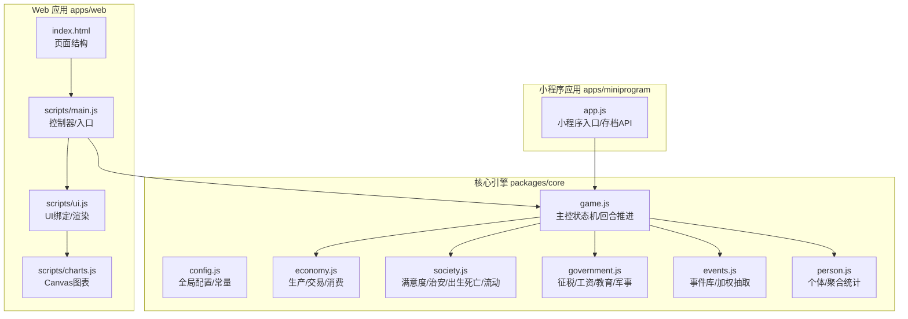
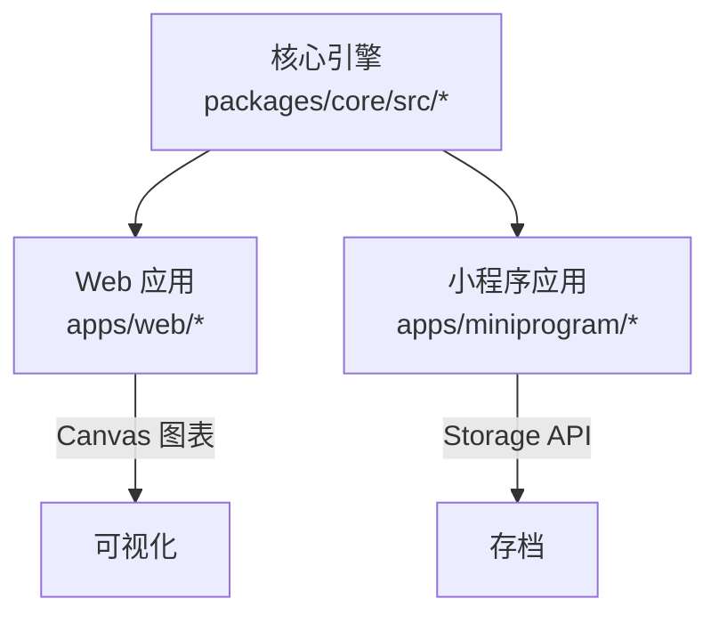
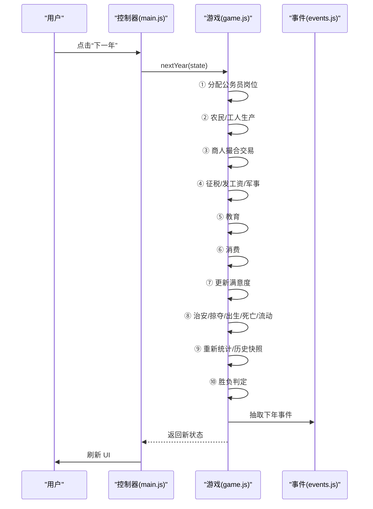
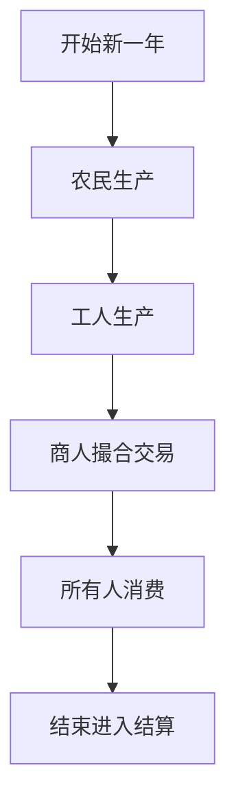
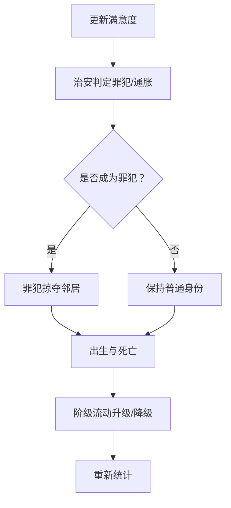
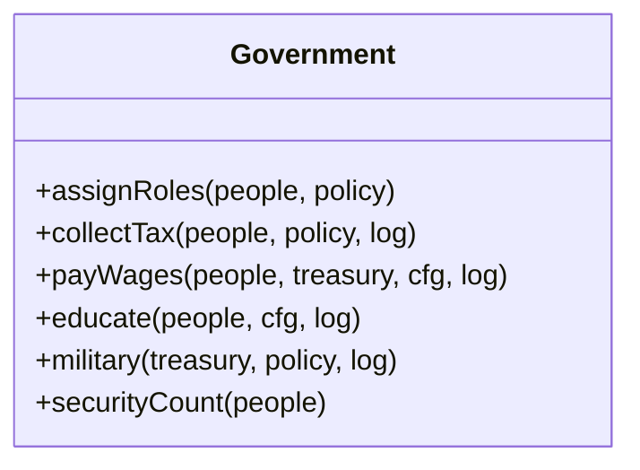
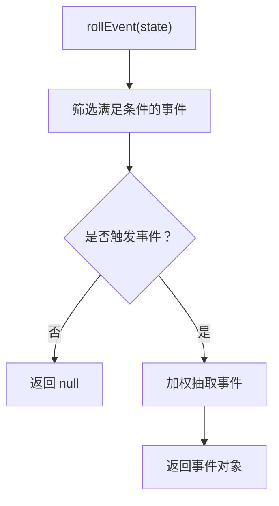
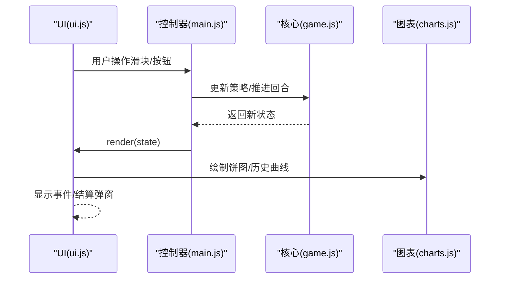
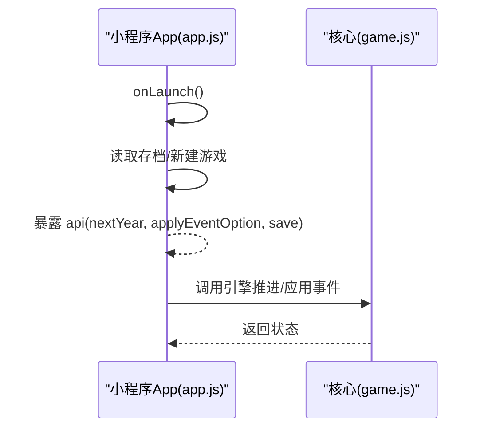
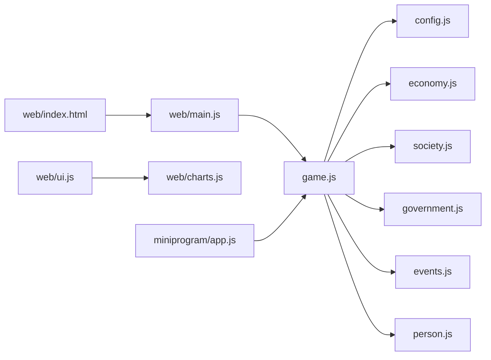

# 项目概述

<cite>
**本文引用的文件**
- [README.md](file://README.md)
- [LICENSE](file://LICENSE)
- [packages/core/package.json](file://packages/core/package.json)
- [packages/core/src/config.js](file://packages/core/src/config.js)
- [packages/core/src/game.js](file://packages/core/src/game.js)
- [packages/core/src/economy.js](file://packages/core/src/economy.js)
- [packages/core/src/society.js](file://packages/core/src/society.js)
- [packages/core/src/government.js](file://packages/core/src/government.js)
- [packages/core/src/events.js](file://packages/core/src/events.js)
- [packages/core/src/person.js](file://packages/core/src/person.js)
- [apps/web/index.html](file://apps/web/index.html)
- [apps/web/scripts/main.js](file://apps/web/scripts/main.js)
- [apps/web/scripts/ui.js](file://apps/web/scripts/ui.js)
- [apps/web/scripts/charts.js](file://apps/web/scripts/charts.js)
- [apps/miniprogram/app.js](file://apps/miniprogram/app.js)
</cite>

## 目录
1. [引言](#引言)
2. [项目结构](#项目结构)
3. [核心组件](#核心组件)
4. [架构总览](#架构总览)
5. [详细组件分析](#详细组件分析)
6. [依赖关系分析](#依赖关系分析)
7. [性能考量](#性能考量)
8. [故障排查指南](#故障排查指南)
9. [结论](#结论)
10. [附录](#附录)

## 引言
小国执政官是一款回合制经济社会模拟游戏，玩家扮演一国执政官，在十年至百年的跨度上进行人口分配、税率调节、事件应对，推动国家走向稳定与繁荣。项目强调“零依赖、跨平台”，核心逻辑以原生 ES Module 实现，既可在浏览器运行，也可直接部署到 GitHub Pages；同时通过小程序桥接层适配微信小程序端。

- 游戏特色：极简水墨风格、完整社会模拟、8张随机事件卡、实时可视化、零构建依赖、跨平台支持
- 目标用户：策略模拟爱好者、独立游戏制作者、开源学习者、教育场景实践者
- 架构理念：平台无关的核心引擎（packages/core）、Web 与小程序双端应用（apps/web、apps/miniprogram）

**章节来源**
- [README.md:1-135](file://README.md#L1-L135)

## 项目结构
项目采用“核心引擎 + 多端应用”的分层组织方式：
- packages/core：平台无关的模拟内核，包含配置、数学、人口、经济、社会、政府、事件、主控状态机等模块
- apps/web：网页版前端，使用原生 HTML/CSS/Canvas 实现可视化与交互
- apps/miniprogram：微信小程序版本，通过 CommonJS 镜像与小程序 API 适配
- docs：文档中心，包含策划案、玩法说明、部署指南、变更日志等
- 根目录：根入口、GitHub Pages 工作流、许可证等

**图示来源**
- [packages/core/src/config.js:1-74](file://packages/core/src/config.js#L1-L74)
- [packages/core/src/game.js:1-185](file://packages/core/src/game.js#L1-L185)
- [packages/core/src/economy.js:1-87](file://packages/core/src/economy.js#L1-L87)
- [packages/core/src/society.js:1-141](file://packages/core/src/society.js#L1-L141)
- [packages/core/src/government.js:1-82](file://packages/core/src/government.js#L1-L82)
- [packages/core/src/events.js:1-145](file://packages/core/src/events.js#L1-L145)
- [packages/core/src/person.js:1-76](file://packages/core/src/person.js#L1-L76)
- [apps/web/index.html:1-131](file://apps/web/index.html#L1-L131)
- [apps/web/scripts/main.js:1-77](file://apps/web/scripts/main.js#L1-L77)
- [apps/web/scripts/ui.js:1-139](file://apps/web/scripts/ui.js#L1-L139)
- [apps/web/scripts/charts.js:1-83](file://apps/web/scripts/charts.js#L1-L83)
- [apps/miniprogram/app.js:1-28](file://apps/miniprogram/app.js#L1-L28)

**章节来源**
- [README.md:43-82](file://README.md#L43-L82)

## 核心组件
- 配置与常量：集中管理阶级、官员角色、默认配置、章节目标与初始人口
- 主控状态机：负责回合推进、事件应用、胜负判定、序列化/反序列化
- 经济模拟：农民生产粮食、工人生产产品、商人撮合交易、所有人消费
- 社会模拟：满意度计算、治安与通胀、罪犯掠夺、出生与死亡、阶级流动
- 政府模块：公务员岗位分配、征税、发工资、教育、军事与治安
- 事件系统：8 张可玩事件，按权重与条件抽取，提供多选项影响国家状态
- 人口与统计：个体属性、初始播种、年度聚合统计（人口、财富、满意度、阶级分布）
- 前端可视化：Canvas 阶级饼图与历史曲线，Hud 展示关键指标，日志与事件弹窗

**章节来源**
- [packages/core/src/config.js:1-74](file://packages/core/src/config.js#L1-L74)
- [packages/core/src/game.js:1-185](file://packages/core/src/game.js#L1-L185)
- [packages/core/src/economy.js:1-87](file://packages/core/src/economy.js#L1-L87)
- [packages/core/src/society.js:1-141](file://packages/core/src/society.js#L1-L141)
- [packages/core/src/government.js:1-82](file://packages/core/src/government.js#L1-L82)
- [packages/core/src/events.js:1-145](file://packages/core/src/events.js#L1-L145)
- [packages/core/src/person.js:1-76](file://packages/core/src/person.js#L1-L76)
- [apps/web/scripts/charts.js:1-83](file://apps/web/scripts/charts.js#L1-L83)

## 架构总览
项目采用“核心引擎 + 多端适配”的架构设计：
- 核心引擎（packages/core）：以 ES Module 形式提供平台无关的模拟逻辑，保证 Web 与小程序共享同一套规则
- Web 端（apps/web）：原生 HTML/CSS/JavaScript + Canvas，无第三方依赖，直接通过浏览器访问
- 小程序端（apps/miniprogram）：通过 CommonJS 镜像与小程序 API 适配，提供存档与生命周期管理
- CI/CD：GitHub Actions 自动部署到 GitHub Pages，简化上线流程

**图示来源**
- [packages/core/package.json:1-12](file://packages/core/package.json#L1-L12)
- [apps/web/scripts/charts.js:1-83](file://apps/web/scripts/charts.js#L1-L83)
- [apps/miniprogram/app.js:1-28](file://apps/miniprogram/app.js#L1-L28)

**章节来源**
- [README.md:102-109](file://README.md#L102-L109)
- [packages/core/package.json:1-12](file://packages/core/package.json#L1-L12)

## 详细组件分析

### 游戏主控状态机（game.js）
- 职责：创建新游戏、推进年份、应用事件选项、胜负判定、历史快照、序列化/反序列化
- 关键流程：三阶段执政（任命 → 结算 → 决策）在 nextYear 中顺序执行，事件在回合末抽取
- 存档：仅序列化必要字段，RNG 状态通过种子保留可复现性

**图示来源**
- [packages/core/src/game.js:59-117](file://packages/core/src/game.js#L59-L117)
- [packages/core/src/events.js:129-144](file://packages/core/src/events.js#L129-L144)

**章节来源**
- [packages/core/src/game.js:1-185](file://packages/core/src/game.js#L1-L185)

### 经济模拟（economy.js）
- 农民生产：基于智力与随机扰动决定产出，受配置参数影响
- 工人生产：产出产品并消耗粮食作为生产成本
- 商人交易：在工人与买家之间撮合，按批发价与加价销售，体现供需与价格弹性
- 消费：所有人按固定需求消耗粮食与产品

**图示来源**
- [packages/core/src/economy.js:7-87](file://packages/core/src/economy.js#L7-L87)

**章节来源**
- [packages/core/src/economy.js:1-87](file://packages/core/src/economy.js#L1-L87)

### 社会模拟（society.js）
- 满意度：考虑食物与产品充足度、阶级财富差距、最穷阶级惩罚
- 治安与通胀：根据阈值判定是否成为罪犯或通胀者
- 罪犯掠夺：随机从邻居抢夺粮食，降低对方满意度
- 出生与死亡：按年龄与概率函数决定，满足条件才成对生育
- 阶级流动：智力与资产驱动的升降，形成社会流动性

**图示来源**
- [packages/core/src/society.js:8-141](file://packages/core/src/society.js#L8-L141)

**章节来源**
- [packages/core/src/society.js:1-141](file://packages/core/src/society.js#L1-L141)

### 政府模块（government.js）
- 公务员分配：按政策将官员分配到税务、治安、民生、军事、教师等岗位
- 征税：按阶级与税率计算，区分农民、工人、商人计税方式
- 工资与教育：按国库能力发放工资，教师提升非官员智力与满意度
- 军事与治安：按国库占比支出，治安官数量决定镇压能力

**图示来源**
- [packages/core/src/government.js:1-82](file://packages/core/src/government.js#L1-L82)

**章节来源**
- [packages/core/src/government.js:1-82](file://packages/core/src/government.js#L1-L82)

### 事件系统（events.js）
- 事件库：包含 8 张可玩事件，每张事件含标题、描述、触发条件、权重与选项
- 抽取机制：按条件过滤候选事件，再按权重加权抽取，有一定概率不出现事件
- 选项影响：不同选项对国库、满意度、政策或人口产生即时或长期影响

**图示来源**
- [packages/core/src/events.js:129-144](file://packages/core/src/events.js#L129-L144)

**章节来源**
- [packages/core/src/events.js:1-145](file://packages/core/src/events.js#L1-L145)

### 前端可视化与交互（apps/web）
- 页面结构：Hud 展示年份、人口、国库、平均满意度、平均智力、罪犯数量
- 控制器：绑定滑块与按钮，调用核心引擎推进回合、应用事件、保存/读取/重启
- 图表：Canvas 绘制阶级人口饼图与历史曲线（人口/满意度/国库）
- 事件与结算弹窗：事件触发时显示选项，结束后展示胜负结果

**图示来源**
- [apps/web/scripts/ui.js:1-139](file://apps/web/scripts/ui.js#L1-L139)
- [apps/web/scripts/main.js:1-77](file://apps/web/scripts/main.js#L1-L77)
- [apps/web/scripts/charts.js:1-83](file://apps/web/scripts/charts.js#L1-L83)

**章节来源**
- [apps/web/index.html:1-131](file://apps/web/index.html#L1-L131)
- [apps/web/scripts/ui.js:1-139](file://apps/web/scripts/ui.js#L1-L139)
- [apps/web/scripts/main.js:1-77](file://apps/web/scripts/main.js#L1-L77)
- [apps/web/scripts/charts.js:1-83](file://apps/web/scripts/charts.js#L1-L83)

### 小程序适配（apps/miniprogram）
- 入口：初始化全局状态，尝试读取本地存档，否则新建游戏
- API：暴露 nextYear、applyEventOption、serialize/deserialize 等接口供页面使用
- 存档：使用 wx.setStorageSync/wx.getStorageSync 进行持久化

**图示来源**
- [apps/miniprogram/app.js:1-28](file://apps/miniprogram/app.js#L1-L28)

**章节来源**
- [apps/miniprogram/app.js:1-28](file://apps/miniprogram/app.js#L1-L28)

## 依赖关系分析
- 模块耦合：game.js 作为中枢，依赖 config、math、person、economy、society、government、events；其他模块相对独立，职责清晰
- 前端耦合：web/main.js 依赖 game.js 与 ui.js；ui.js 依赖 charts.js；HTML 作为入口
- 小程序耦合：miniprogram/app.js 依赖 core/game.js 的 CommonJS 镜像
- 外部依赖：零构建依赖，仅使用原生 ES Module 与浏览器/小程序 API

**图示来源**
- [packages/core/src/game.js:1-185](file://packages/core/src/game.js#L1-L185)
- [apps/web/scripts/main.js:1-77](file://apps/web/scripts/main.js#L1-L77)
- [apps/web/scripts/ui.js:1-139](file://apps/web/scripts/ui.js#L1-L139)
- [apps/web/scripts/charts.js:1-83](file://apps/web/scripts/charts.js#L1-L83)
- [apps/miniprogram/app.js:1-28](file://apps/miniprogram/app.js#L1-L28)

**章节来源**
- [packages/core/package.json:1-12](file://packages/core/package.json#L1-L12)

## 性能考量
- 人口规模：当人口超过阈值时启用桶模拟（配置项），减少大规模迭代开销
- 可视化：Canvas 绘制饼图与折线图，避免第三方库依赖，渲染效率高
- 存档：仅序列化必要字段，RNG 状态通过种子复现，减小存储体积
- 事件：按权重与条件筛选候选事件，降低无效计算

**章节来源**
- [packages/core/src/config.js:56-58](file://packages/core/src/config.js#L56-L58)
- [packages/core/src/game.js:164-182](file://packages/core/src/game.js#L164-L182)

## 故障排查指南
- 无法启动本地服务（Web）：确认已在根目录执行静态服务器命令，并通过 apps/web 访问
- 小程序无法加载：检查开发者工具导入路径是否为 apps/miniprogram/，确保 CommonJS 镜像可用
- 存档异常：检查本地存储键值是否存在，读档失败时查看错误提示
- 事件未出现：事件存在概率与权重机制，若未触发属正常现象
- 胜负判定：关注人口、国库、满意度、罪犯比例等关键指标，及时调整政策

**章节来源**
- [README.md:18-42](file://README.md#L18-L42)
- [apps/web/scripts/main.js:49-74](file://apps/web/scripts/main.js#L49-L74)
- [apps/miniprogram/app.js:9-27](file://apps/miniprogram/app.js#L9-L27)

## 结论
小国执政官以“零依赖、跨平台”为核心理念，通过平台无关的模拟内核与简洁的前端实现，提供了完整的回合制经济社会模拟体验。其模块化设计便于扩展与维护，适合初学者快速上手，也为经验开发者提供了清晰的技术架构参考。项目采用 MIT 许可证，鼓励社区贡献与二次创作。

## 附录
- 开源协议：MIT
- 贡献方式：提交 Issue/PR，提供数值平衡反馈、新增事件卡、美术资源替换、多语言支持等
- 在线游玩：GitHub Pages、本地浏览器、微信小程序
- 文档导航：策划案、玩法说明、部署指南、变更日志

**章节来源**
- [LICENSE:1-16](file://LICENSE#L1-L16)
- [README.md:119-135](file://README.md#L119-L135)
- [README.md:18-27](file://README.md#L18-L27)
- [README.md:110-118](file://README.md#L110-L118)